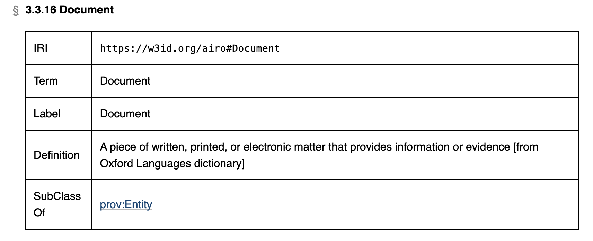

## Documentation (AIRO)

This section provides an overview of required documentation, and MQG4AI is intended to provide the required information, which needs to be extracted and transformed into document-format.
The [Lifecycle implementation](../../2_Lifecycle/AI_Lifecycle.md), as well as [AI risks](../../3_RiskManagement/AI_Risks/) define relevant information to fill documentation such as the instructions of use, or post-market monitoring information, for instance.

{width=800 height=}

An [overview how to organize AI Act conform documentation in form of AI cards](https://link.springer.com/chapter/10.1007/978-3-031-68024-3_3):

{width=800 height=}

#### Data

- Data.has documentation (data requirements (e.g. IEEE standard on medical data quality - datasheet))
- Data.has documentation (characteristics of data - e.g. distribution, ... datasheet)
- InputData.has documentation (specification - data sheet)

#### Overall System

AI System:

- has documentation (blueprint) \
  (internal layout of the product which is system is part of) (generally applicable - indicates a document related to an entity)
- has documentation (system design specification)
- has documentation (system architecture)
- has documentation (EU declaration of conformity)

#### Execution Environment

AI System:

- has execution environment (AI Hardware)
- runs on hardware
- has component (tool)

#### Post-Market Monitoring:

AI System:

- has documentation (description of post-market monitoring system)
- has post-market monitoring system (post-market monitoring system)

#### Risk Management (appended based on the overview introduced above):

AI System:

- has documentation (description of risk management system)
- has post-market monitoring system (risk management system)

#### Testing

AI System:

- has documentation (test log)
- has documentation (test report)

#### Use

AI System:

- has documentation (instruction of use):
  - levels of accuracy and the relevant accuracy metrics
  
- has documentation (installation instruction)

