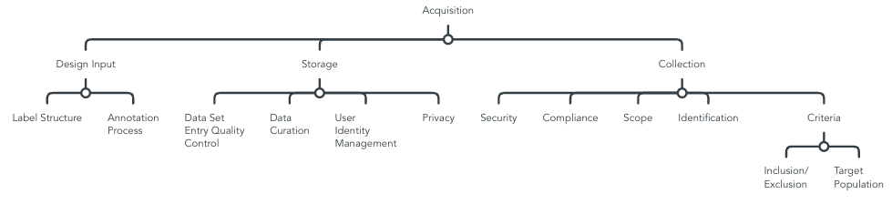

## QG Acquisition (Data)

Data Acquisition provides information on the data set, and is strongly related with [AI system information](./../../../1_System/AI_System.md), including the intended purpose, and domain knowledge. In addition, supplementary processes, such as annotation, or secure data storage are defined.

### Overview Sub-QGs
Exemplary overview of process steps, based on [IEEE Recommended Practice for the Quality Management of Datasets for Medical Artificial Intelligence (IEEEData)](https://ieeexplore.ieee.org/document/9812564), [An artificial intelligence life cycle: From conception to production (CADAC)](https://www.sciencedirect.com/science/article/pii/S2666389922000745) and ISO/IEC FDIS 5338:2023(E) on *Information Technology -- Artifical Intelligence -- AI system lifecycle processes*

> This is only a proposition based on our contribution of this MQG4AI-template.

#### Design input
- "intended use, clinical representativeness, annotation processes, and data format" (IEEEData, 17)
- Annotation task "document the definition of the data annotation task, including contents and formats of annotation output,
annotation rules, and verification approach of annotation results." (IEEEData, 20)
- Annotation Process "document the annotation process and clarify how an annotation decision is made. If an annotation decision relies on individual annotators, the data set responsible organization
should clarify the requirement for such annotators" (IEEEData, 20)
    - Data labelling  controlled (annotation) process - competent persons (ISO5338, 23)
- Data exploration - domain understanding (ISO5338, 23)

#### Data storage
- "Records should be kept for the following operations: permission control, user activity, data utility, and data distribution" (User identity management, Privacy management, Reliability of the data set storage system (device requirements allow backup, repair nodes)) (IEEEData, 20)
- Enable "data curation, i.e., the process to compile the data, actively manage and add value to the data, and realize the transformation from data collection to data processing and use" (Integration, association aggregation, data statistics, data packaging, data transparency) (IEEEData, 19)
- "Before the entry of data into a data set, quality control actions should be conducted by the data set administrator to help ensure its quality" (IEEEData, 20)
- Data siloes are not recommended - "The recommended approach is to design and develop a unified data repository, such as a data warehouse,
data lake, or data lakehouse, that centralizes data access, ownership, stewardship, metadata, data ethics, governance, and regulations, before the development of AI models." (CADAC, 5)

#### Data collection
- "Standard operating procedures" (assign identification to data elements and help ensure their uniqueness and traceability; criteria of data collection, including inclusion/exclusion conditions, target population,..; security) (IEEEData, 18)
- Data set distribution "operating procedures should be established to help ensure the security and consistency of data
distribution" (fine-grained authorization, consistency monitoring, secure import and export) (IEEEData, 21)
- Sensitive data protection
"increase in attack surface of an AI system", e.g. data storage can be attacked, the more sources the more attack surface
highlight need for "privacy-preserving techniques" (ISO5338, 24)
- "Data privacy, confidentiality, and integrity are related to data preparation, but not directly applicable to the AI life cycle. Also discussed as the cybersecurity triad, in terms of data, these topics are typically regulated by law. The General Data Protection
Regulation is the gold standard across the world for data protection and regulation. Furthermore, datasets and sources
must be assessed for security risks, such as poisoning attacks and backdoor attacks." (CADAC, 5)