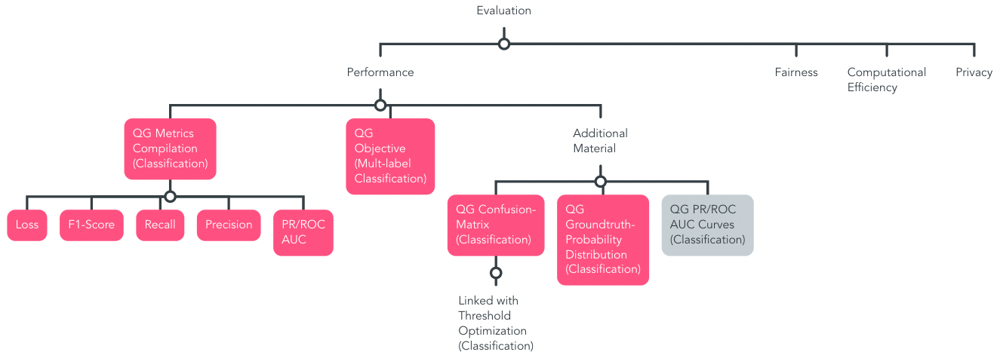

# QG Evaluation (Model)

This section structures conceptual information on model evaluation techniques. Generally, two types that should best be merged exist: **technical and human evaluation**, since the real success of the application can only be measured in the real world.

> Main Question: Did the system achieve its intended purpose in the real world?

Horizontal interdependencies that are relvant for or impacted by the evaluation startegy are related to the [Model Configuration](./../1_Model_Configuration/QG_ModelConfiguration_(Development).md), [Data utilization](./../../1_Data/2_Utilization/QG_Utilization_(Data).md) such as pre-processing, the setup and quality of the test set, and [Optimization](./../3_Model_Optimization/QG_ModelOptimization_(Development).md).

Among others, they shape Input- and Output Information of the Interdependency Graph in the [Leaf-QG template](../../../../templates/Template_LeafQG.md) for design decisions.

Optimization is conceptually monitored by MQG4A-template versions that illustrate different combinations of implementation approaches and how they relate with results. First, a suitable Evaluation strategy needs to be identified as foundation.
If concrete implementation concepts, e.g. in form of specific metrics, exist, MQG4A, as well as MQG4DK offer concept documentation contributing to the evaluation section. If the evaluation approach consists of a combination of design decisions, e.g. in combination with changes to the underlying data, e.g. in form of a different pre-processing setup and their impact on performance evaluation, such as in case of robustness evaluation through adversarial examples, or generalizability with multiple independent test sets, different MQG4A-template versions including concrete results are monitored to compare different design versions against one another. 
With respect to MQG4DK, a combination of design decisions that belong together is appended.
QGs should be linked with risks such as [over- or underfitting](./../../../3_RiskManagement/AI_Risks/2_TechnicalRobustnessSafety/Accuracy/Over_UnderFitting.md), for instance.

- compare with main approach maybe link MQG4A-version in main with generalizability-version

General rule of thumb for application: if a desired criteria is measured based on modifications to other stages such as data - create an MQG4A-version that is based on the identified performance metrics and documents design modifications including concrete results. For maintenance, specify thresholds that identify e.g. model drift need to be identified. For instance, tools such as MLflow can be embedded within the template for comparing different runs.
Otherwise, if concrete metrics exist that measure particular criteria - append them to evaluation, such as privacy, fairness or computational efficiency.

Raw *model output* including transformations for evaluation is appended to the [Data utilization stage](./../../1_Data/2_Utilization/QG_Utilization_(Data).md), analoguously to pre-processing, since this is equally generated data that is addressed by other stages, such as evaluation.

### Overview Sub-QGs

> This is a proposition based on our contribution of this MQG4AI-template. Identified leaf-QGs are marked grey, and the proposed QG-compilation for reliable multi-label classification in emergency medicine is colorized pink.