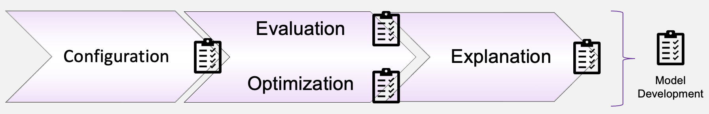
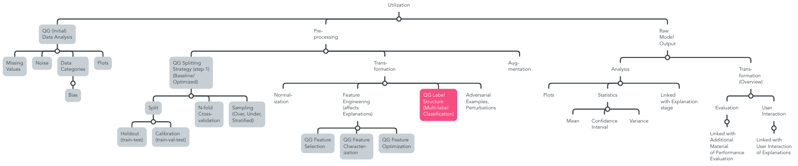
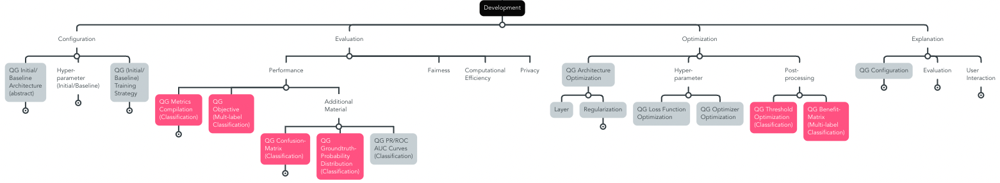

# QG Development

[*Evaluation Metrics* during *Development*](./2_Model_Evaluation/QG_ModelEvaluation_(Development).md) are at the center of our current contribution, and closely related with *Data* pre-processing information, as well as *AI System*-specific information regarding the *Application* and *Stakeholder*, while design decisions impact *Maintenance* and *Deployment*, and provide relevant information for *Documentation*. Further, we put a particular emphasis on the [Explanation stage](./4_Model_Explanation/QG_ModelExplanation_(Development).md).

During the Model Development stage, the conceptual setup of the model is defined, and the four main stages are executed in an iterative manner to build the model step by step on a conceptually sound foundation that is empirically backed for the respective the use case, which shapes the following generic lifecycle stages.

{width=800 height=}

- The first iteration establishes the *Training* pipeline, and defines QGs for a vertical baseline-approach, which is based on state-of-the-art implementation guidelines, if existent. and closely tied to [data pre-processing](./../1_Data/2_Utilization/QG_Utilization_(Data).md), which prepares the data for the model.

Horizontal interdependencies that are relvant for Development are related to the [data utilization stage](./../1_Data/2_Utilization/QG_Utilization_(Data).md), and impact [Deployment](./../3_Deployment/QG_Deployment_(Lifecycle).md) and [Maintenance](./../4_Maintenance/QG_Maintenance_(Lifecycle).md), once a satisfying model concept is identified. 

Among others, they shape Input- and Output Information of the Interdependency Graph in the [Leaf-QG template](../../../templates/Template_LeafQG.md) for design decisions. In addition, MQG4A-versions are shaped by [AI System information](./../../1_System/AI_System.md), and provided approaches are linked to [Risk management](./../../3_RiskManagement/AI_RiskManagement.md)

Optimization is conceptually monitored by MQG4A-template versions that illustrate different combinations of implementation approaches and how they relate with results.
Therefore, [Model Configuration](./1_Model_Configuration/QG_ModelConfiguration_(Development).md) provides a base-line approach that is optimized based on [evaluation strategy](./2_Model_Evaluation/QG_ModelEvaluation_(Development).md) through methods that are summarized in [Optimization](./3_Model_Optimization/QG_ModelOptimization_(Development).md). Further, [explanation methods](./4_Model_Explanation/QG_ModelExplanation_(Development).md) are planned.

- Especially, the *Evaluation* strategy needs to be sound and reasonable with respect to the indented use, since it is the foundation for further *Optimization*, evaluation scenarios, and impacts *Explanation*.
- Finally, the *Design Decision-making* section provides information aiming to enable an independent, and methodologically sound exection of the *Development* phase, which includes additional *Development*-specific information, such as open-source data, design decision-making procedures or bench-marking information.

Overall, we propose the following organization of sub-QGs with a collection of leaf-QGs along the identified process stages, as a start.

### Overview Sub-QGs
Exemplary overview of process steps, based on [An artificial intelligence life cycle: From conception to production (CADAC)](https://www.sciencedirect.com/science/article/pii/S2666389922000745), ISO/IEC FDIS 5338:2023(E) on *Information Technology -- Artifical Intelligence -- AI system lifecycle processes*, and ISO/IEC 22989:2022 on *Information technology — Artificial intelligence — Artificial intelligence concepts and terminology*

> This is only a proposition based on our contribution of this MQG4AI-template. Identified leaf-QGs are marked grey. Our proposed contribution of leaf-QGs for reliable multi-label performance evaluation is depicted in pink.

#### Configuration
- Design of the first or baseline model (CADAC, 7) 
- the selection and optimization of algorithms involves experimentation to determine the most suitable technique (ISO5338, 25)
- model selection includes considering the trade-off between interpretability and performance (ISO5338, 25)
- may include transfer learning, where "[...] an existing machine learning model is used as a starting point to further train for a slightly different use case" (ISO5338, 26)

#### Evaluation
- Defining the evaluation strategy in alignment with the use case at hand, including data utilization steps results in developing a benchmark (CADAC, 7) 
- Central role of reliable performance evaluation as foundation for further analysis along the AI lifecycle (CADAC, 8) to avoid AI pitfalls
- Effective metrics should be accurate, robust, agnostic, scalable, and interpretable. (CADAC, 8) 
- For instance, "ISO/IEC TS 4213:2022 Information technology — Artificial intelligence — Assessment of machine learning classification performance" provides a comprehensive list of key concepts in classification performance evaluation, including statistical tests and different types of classification
- model verification includes checking if any "[...] relevant performance characteristic of the AI system meets specific requirements" (ISO22989, 39)
- This involves calculating supplementary metrics, including computational (CPU) and memory performance, time complexity, ethical implications, and convergence metrics. Additionally, metrics for assessing risks such as privacy, cybersecurity, trust, robustness, explainability, interpretability, usability, and societal impacts, such as AI fairness metrics and privacy evaluation are required. (CADAC, 8)

#### Optimization
- Model tuning involves "[e]mploying optimisation techniques to find the hyperparameters that provide the best performance, using validation data" (ISO5338, 25)
- This process builds upon the performance benchmark, which helps identify gaps in the initial model. Subsequent models are then refined by incrementally increasing their complexity (CADAC, 7) 
- This process is closely tied to data utilization strategies applied to validation and test data, as discussed previously. Further, expert knowledge plays a critical role in this phase, with "[...] distributing the work between experts and computer resources to experiment in parallel" further enhancing development efficiency. (ISO5338, 26)

#### Explanation
Subprocesses are introduced in (TODO LINK PAPER), and globally align with the concepts, as outlined in [IEEE Guide for an Architectural Framework for Explainable Artificial Intelligence](https://standards.ieee.org/ieee/2894/11296/) 
- Explainability refers to an AI system's ability to present the key factors influencing its decisions in a manner comprehensible to humans. (ISO22989, 29)
- "Explainability can also be a useful means of validating the AI system, even where the decisions do not directly affect humans" (ISO22989, 30)
- It aids AI scientists by clarifying how attributes, learning processes, and parameters influence the AI system’s outcomes, thereby enhancing model development (CADAC, 8)