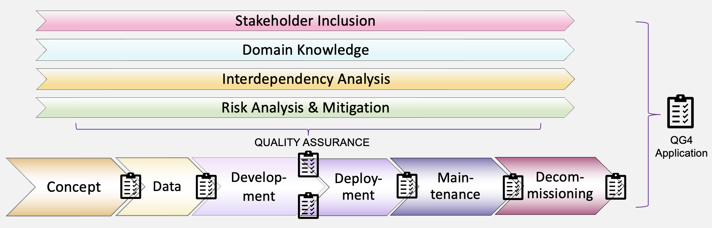

## AI Lifecycle - QG4Application (System Implementation)
This section represents relevant information about the implemented concepts and techniques structured along the AI lifecycle, i.e. all design decisions that together result in the intelligent system in form of QGs. They are created as part of *Conceptualization* phase iterations.
The information is summarized in the root *QG4Application* for system-wide evaluation scenarios, and generated information is related with other relevant AI quality management information within leaf-QGs.

### AI Technique (AIRO) for Lifecycle Implementation

{width=800 height=}

### QG4Application - Overview AI Lifecycle
The AI lifecycle can be depicted as sequential process stages. In reality, these stages are closely related, thanks to complex interdependencies. They are executed in an iterative manner resulting in multiple lifecycle evolutions, that build on previously established information. As a consequence, all stages are addressed in parallel, possibly with a differring main focus depending on the state of the lifecycle evolution. 

Conceptual design decisions that constitute the model are finalized based on multiple iterations of the *Development* stage in relation with the *Data*, and *System* information. For instance, model evaluation includes defining the performance evaluation metrics compilation, which is calculated through multiple iterations, and comparison with a baseline approach towards reliability. It comprises valuable information for later stages, which is propagated to *Maintenance* (continuous performance monitoring) and *Deployment* (e.g. on-boarding information how to interpret metrics for users), while some design decisions, such as performance-related *threshold optimization*, need to be updated in accordance with new information encountered after the model has arrived in its intended real-world setting, which restarts the lifecycle, as depicted below. 

In addition to complex interdependencies, the project-specific lifecycle implementation is characterized by a high use case-specificity, which results in different implementations that depend strongly on strutcural pre-requisites of the AI scenario at hand. As part of our contribution, we envision to identify generalizable *Lifecycle* stages to structure information on design decisions for MQG4A-scenarios, and MQG4DK contributions alike. We focus on the model *Development* stage (specifically evaluation metrics), and related information during the *Data* stage.
 
 