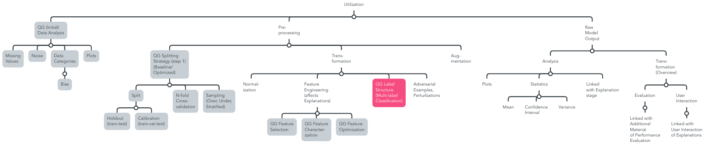

## QG Utilization (Data)

Data Utilization is broadly defined by an initial data analysis to ensure the desired quality through data cleaning techniques, which includes plotting and analyzing data categories to better comprehend the overall data set.
In addition, data preprocessing prepares the data for [Model Development](../../2_Development/QG_Development.md).
It is strongly influenced by the model, and influences the model's performance, as well as explanations.
Finally, raw model output contributes the final stage of model utilization, which is references by other model development stages. Especially raw output including transformations is relevant to evaluation and optimization, as well as explanation. This section is intended to provide an overview of applied rwa output transformations with a purpose, as well as raw output analysis for quality monitoring.

Horizontal interdependencies that are relvant for data utlization are related to the [Model Development](../../2_Development/QG_Development.md). 
It is strongly influenced by the [model](../../2_Development/1_Model_Configuration/QG_ModelConfiguration_(Development).md), and influences the model's [performance](../../2_Development/2_Model_Evaluation/QG_ModelEvaluation_(Development).md), as well as [explanations](../../2_Development/4_Model_Explanation/QG_ModelExplanation_(Development).md). Adjusting data preprocessing steps contributes to [Model Optimization](../../2_Development/3_Model_Optimization/QG_ModelOptimization_(Development).md).

Among others, they shape Input- and Output Information of the Interdependency Graph in the [Leaf-QG template](../../../../../templates/Template_LeafQG.md) for design decisions.

Optimization is conceptually monitored by MQG4A-template versions that illustrate different combinations of implementation approaches and how they relate with results.

### Overview Sub-QGs
Exemplary overview of process steps, based on [IEEE Recommended Practice for the Quality Management of Datasets for Medical Artificial Intelligence (IEEEData)](https://ieeexplore.ieee.org/document/9812564), [An artificial intelligence life cycle: From conception to production (CADAC)](https://www.sciencedirect.com/science/article/pii/S2666389922000745) and ISO/IEC FDIS 5338:2023(E) on *Information Technology -- Artifical Intelligence -- AI system lifecycle processes*

> This is only a proposition based on our contribution of this MQG4AI-template. Identified leaf-QGs are marked grey, and contributed leaf-QGs as part of the performance evaluation compilation pink.

#### (Initial) Data Analysis
- "Data cleaning is the identification of data that is not applicable to the data set and the correction of data that has
errors." (IEEEData, 18)
- Aim is cleaned data and visualization, e.g. missing values, noise, data categories, plots
- Rule of thumb: "inclusion and exclusion criteria during data cleaning should comply with the intended use of the data set and data collection criteria" (missing values, noisy, outliers, inconsistent, duplicate) (IEEEData, 19)
e.g. includes "checking relationships between data points and attributes, handling outliers" (CADAC, 5)
- Analyze data quality (ISO5338, 23):
    - "bias should be within acceptable limits" (ISO5338, 23)
    - here, data poisoning risk "if unwanted changes - changes in model behavior" (ISO5338, 23)
    - "Filtering removes unwanted data that is: not useful to create or verify the model (e.g. outliers in some situations); unnecessary in volume, so a sample can suffice; harmful or biased or introduces unwanted bias or unwanted discrimination (e.g. related to gender or ethnicity); against privacy legal requirements, requiring removal or de-identification of personal data; sensitive data that should be protected from unauthorized internal or external access." (ISO5338, 24)

#### Preprocessing
- "The pre-processing stage ensures that all the data that have been acquired to build the AI model/application can be accurately
input into the AI algorithm, with minimal compromise of accuracy, informational value, and data quality" (CADAC, 6)
- "A further consideration of this stage is splitting the data for model development and evaluation" (CADAC, 6)
    - Needs to be executed before Data transformation to avoid AI pitfalls [Generalizability of Machine Learning Models: Quantitative Evaluation of Three Methodological Pitfalls](https://pmc.ncbi.nlm.nih.gov/articles/PMC9885377/)
    - Also, N-fold Cross-validation and sampling techniques may impact one another [Joint use of over- and under-sampling techniques and cross-validation for the development and assessment of prediction models](https://pmc.ncbi.nlm.nih.gov/articles/PMC4634915/pdf/12859_2015_Article_784.pdf)
    - test data from different source than training data to circumvent generalization issues (ISO5338, 23)
- transformation: "data transformation is to convert the data by changing the value and characteristics of the data according to the intended use of data sets." (normalization, data enhancement, (feature engineering)) (IEEEData, 19) "Transformation is the conversion of non-numerical data types into numerical representations using methods such as label encoding or one-hot encoding" (CADAC, 6)
    - It includes e.g. Normalization "Data formatting is more straightforward where units of measurement, date format, or non-overlapping groups must be standardized across all variables in the dataset and the expected output of the AI model." (CADAC, 6)
    - Feature engineering (ISO5338, 24) "Feature engineering is the process of selecting, characterizing and optimizing features for use in an AI model. In this process, selecting optimal features input can be done using domain knowledge, data analysis or experimenting with different selections of features. Some notable types include optimising the selection of features. In general, the fewer features that are used, the easier it is to train a machine learning model and the fewer risks of data errors in feature engineering." (ISO5338, 24) 
- augmentation "manage data augmentation activities." (technique, training data, verification of methods..) (IEEEData, 22)
"In contrast to data transformation, which is specific to variables, augmentation includes, class imbalance,
feature engineering, and feature representation, the initial model will be re-run several times as the effectiveness of the augmentation
measures are evaluated." (CADAC, 7)

#### (Raw) Model Output (appended by us)
- Implement an overview of concepts on raw model output (analysis, transformation) to the data utilization stage that are linked with their related stages.
- Analyze raw model output, including creation of plots and calculation of statistical values (mean, variance, confidence intervals).
- Overview on transformations performed on rwa model output
    - Provide insights into the model's performance through transformations of raw output.
    - Utilize these transformations for performance evaluation, such as threshold-based confusion matrices for classification metrics.
    - Align transformed raw outputs with user interaction and explanation stages, ensuring relevance and clarity in user-facing explanations.