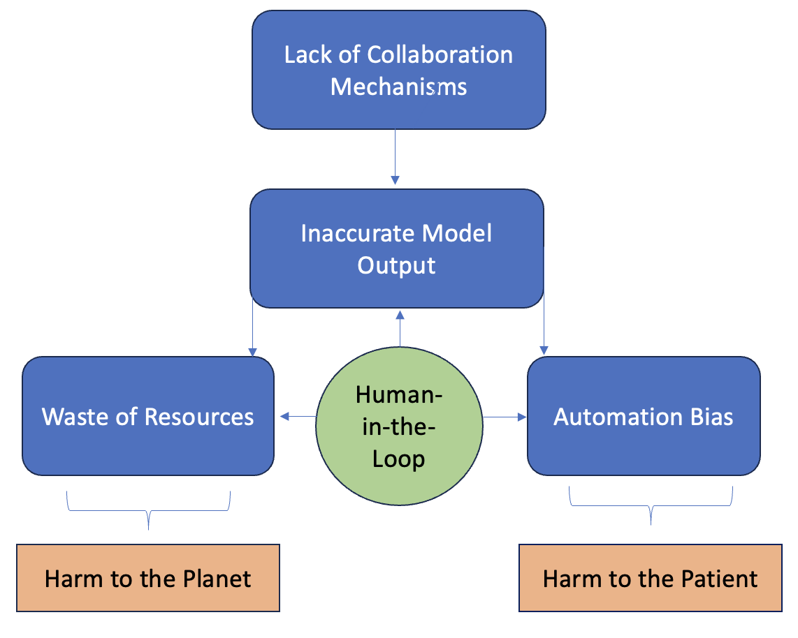

## Risk Management TBE Segmentation

> For our simulation, we focus on model output (it is directly tied to the model configuration) and its effects on the [physician who interacts with the intelligent system](../1_System/Stakeholder/3_Passive/Physician_(PassiveStakeholder).md). Identified risks negatively impact the intended use (supporting the physician when creating the 3D-reconstruction) if not mitigated.

We identified four risks, centered around the proposed human-in-the-loop approach of model application within the medical software, as described [here](../1_System/Application/TBE_Segmentation.md). 

- Diversity, Non-discrimination and Fairness (Stakeholder Participation):
    - [Lack of collaboration mechanisms](./5_DiversityNon-DiscriminationFairness/StakeholderParticipation/LackofCollaborationMechanisms_(TBE_Segmentation).md), as a cause for possibly missing inaccurate model output during maintenance focusing on the human-in-the-loop

- Robustness and Safety (Accuracy):
    - [Inaccurate model output](./2_TechnicalRobustnessSafety/Accuracy/InaccurateModelOutput_(TBE_Segmentation).md), as main risk related to model selection

- Societal and Environmental Well-being (Environmental Well-being):
    - [Waste of computing resources](./6_SocietalEnvironmentalWellbeing/EnvironmentalWellbeing/WasteOfComputingResources_(TBE_Segmentation).md), as a risk resulting from not using the segmentation model due to bad performance

-  Human-Agency and Oversight (Human Oversight):
    - [Automation bias](./1_HumanAgencyOversight/HumanOversight/AutomationBias_(TBE_Segmentation).md), as an identified cause of TBE segmentation model misuse, negatively impacting the quality of the generated 3D-reconstruction, which may result in harm to patient well-being. 

> Other possible risks that are not directly related to model selection comprise data governance and privacy-related risks, or robustness-related security risks, possible attacks, such as data poisoning or model evasion, for instance. 

> In addition, risks may be appended based on further design decision-making which is conducted through different template versions for documentation

{width=600 height=}
> Identified risks focusing on the human-in-the-loop
