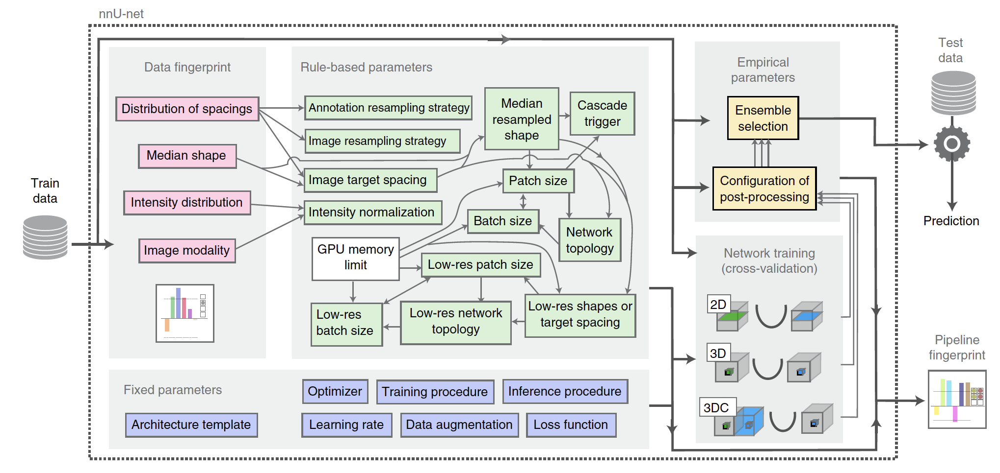

## QG no-new Net (nnU-Net) (State of the Art for segmentation) 

Introduced in [nnU-Net: a self-configuring method for deep learning-based biomedical image segmentation](https://www.nature.com/articles/s41592-020-01008-z)
- [Related repo](https://github.com/MIC-DKFZ/nnUNet)

### 1. Interdependency Graph

#### Input Information
> What information is necessary to execute the method and generate the content?

- ##### Related QGs
    > Which stages are required? What pre-requisites exist so the content dimension can be applied?

    [Data Design Input]
    [Data Preprocessing (nn-Unet)]

- ##### AI System Information
    > Which AI system-specific information is relevant so the content dimension can be applied?

     Stakeholder [Developer]

#### Output Information 
> What information is produced that is relevant to other stages and design decisions?

- ##### Related QGs
    > Which stages are impacted and which additional information might be necessary?

- ##### Post-Market Monitoring Information (Maintenance Stage)
    > Is there relevant information for post-market monitoring?

 

### 2. Quality Gate Creation (Design-Decision-Specific Dimensions)

#### Dimension 1: Content
> Which information is generated?

{width=600 height=}
> Architecture, as depicted in the introductory publication on p.205:
> "nnU-Net is a deep learning-based segmentation method that automatically configures itself, including preprocessing, network architecture, training and post-processing for any new task in the biomedical domain." (p. 204)
> nnU-Net v2 is applied for training

- minimize averaged Dice and Cross-entropy loss during training
- Poly learning rate schedule (initial, 0.01)
- Stochastic gradient descent (SGD) optimizer with Nesterov momentum (μ = 0.99)

- Training: 1,000 epochs × 250 minibatches, foreground oversampling
- Inference: Sliding window with half-patch size overlap, Gaussian patch center weighting

[Supplementary notes on nn-Unet design principles](https://static-content.springer.com/esm/art%3A10.1038%2Fs41592-020-01008-z/MediaObjects/41592_2020_1008_MOESM1_ESM.pdf)

#### Dimension 2: Method
> How is the information generated? 

Easy to apply, automatic configuration and adaptation to respective data 

#### Dimension 3: Representation
> How should which information should be presented to which stakeholders and when?

##### Developer

applies the model architecture

 

#### Evaluation
> What are open questions when applying the generated information?

Could this automatic configuration possibly be optimized?

 

### 3. Additional Information

#### Risk Management

- ##### Poses Risk(s)
    > Are there related risks?

- ##### Implements Risk Control(s)
    > Are there risk controls implemented?

#### ...
