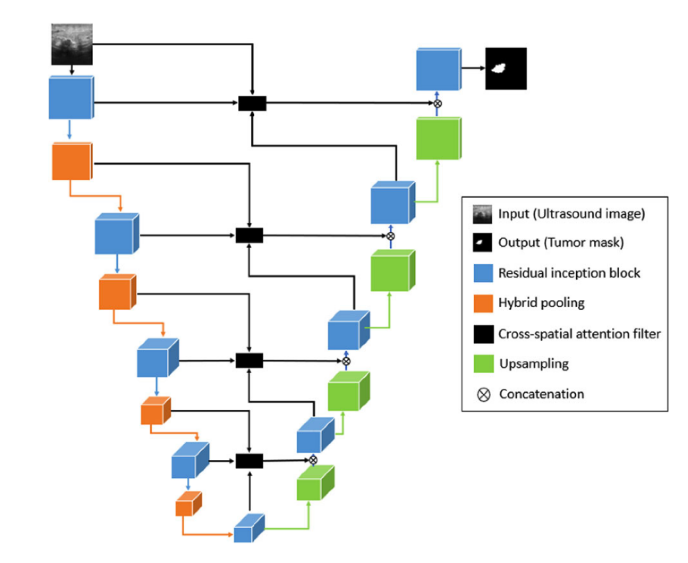
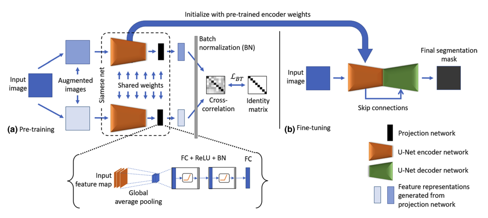

## QG Residual Cross-spatial Attention Guided Inception U-net (RCA-IUnet) (ModelComparison) 

Introduced in [RCA-IUnet: a residual cross-spatial attention-guided inception U-Net model for tumor segmentation in breast ultrasound imaging](https://link.springer.com/article/10.1007/s00138-022-01280-3)
- [Related repo](https://github.com/nspunn1993/RCA-IUnet)

### 1. Interdependency Graph

#### Input Information
> What information is necessary to execute the method and generate the content?

- ##### Related QGs
    > Which stages are required? What pre-requisites exist so the content dimension can be applied?

    [Data Design Input]
    [Data Preprocessing]

- ##### AI System Information
    > Which AI system-specific information is relevant so the content dimension can be applied?

    Stakeholder [Developer]

#### Output Information 
> What information is produced that is relevant to other stages and design decisions?

- ##### Related QGs
    > Which stages are impacted and which additional information might be necessary?

    [Model performance evaluation]

- ##### Post-Market Monitoring Information (Maintenance Stage)
    > Is there relevant information for post-market monitoring?

    [Model retraining when new data is labeled]
    [Data]

 

### 2. Quality Gate Creation (Design-Decision-Specific Dimensions)

#### Dimension 1: Content
> Which information is generated?

{width=500 height=}
> Architecture, as depicted in the RCA-IUnet introductory publication on p.3:
> "The network follows U-Net topology where standard convolution and pooling operations are replaced by inception convolution with short skip connections and hybrid pooling along with the cross-spatial attention filter on long skip connection to focus on the most relevant features" (p.3)

{width=800 height=}
> Training framework as depicted in the introductory publication on p.4591
> Other U-Net versions can be utilized within this proposed framework

1. Self-supervised learning based on [Barlow Twins](https://proceedings.mlr.press/v139/zbontar21a.html) via redundency reduction (starting on p.4590):
> Learn the complex feature representations of raw TBE dataset using unannotated data samples.
> The encoder network of the U-net is trained using the Barlow Twins self-supervised learning strategy
> It is initialized with random weights (see optimization - transfer learning for a different approach)

- Input image into the model's encoder. 
- Projection header generates the encoded feature representation in the desired dimension. 
- The projection head receives the feature maps from the encoder as input and then processes them further, first in a global average pooling and then in two blocks consisting of fully connected layers, ReLU activation and batch norm. 
- The final encoded feature representations are generated by another fully connected layer. 
- (Following empirical testing, it is recommended that the number of output neurons of the Barlow Twins be limited to half the height or width of the input image in order to achieve efficient pretraining)
- Use the resulting feature representation for self-supervised training
- Train 100 epochs
    - Adam Optimizer
    - [Learning rate (LR) scheduler](https://arxiv.org/abs/1608.03983):
        Implements an LR scheduler that warms up the learning rate for some training steps (usually at the beginning of the training) and then decays it with CosineDecay 
    - apply early stopping with patience = 10 epochs without improvement
    - reduce LR on plateau by 0.1
    - Minimize the Barlow Twins loss
- Discard projection head weights, since they are not relevant for the actual image segmentation
- Transfer the learned weights to the model's encoder, all other values are default values
   

2. Fine-tuning
> Train the U-Net with the labeled data using the self-supervised encoder weights

- train 100 epochs
    - Adam optimizer
    - apply early stopping with patience = 10 epochs without improvement
    - reduce LR on plateau by 0.1
    - minimize soft dice loss

#### Dimension 2: Method
> How is the information generated? 

Based on [BT-Unet: A self-supervised learning framework for biomedical image segmentation using barlow twins with U-net models](https://link.springer.com/article/10.1007/s10994-022-06219-3):

- Selected since RCA-IUnet displays superior performance compared to other methods within this framework (p. 4594)

#### Dimension 3: Representation
> How should which information should be presented to which stakeholders and when?

##### Developer

Needs to understand and implement the model architecture

 

#### Evaluation
> What are open questions when applying the generated information?

For a better comparison against nnU-Net, pre-processing steps could be aligned.

 

### 3. Additional Information

#### Risk Management

- ##### Poses Risk(s)
    > Are there related risks?

- ##### Implements Risk Control(s)
    > Are there risk controls implemented?

#### ...
