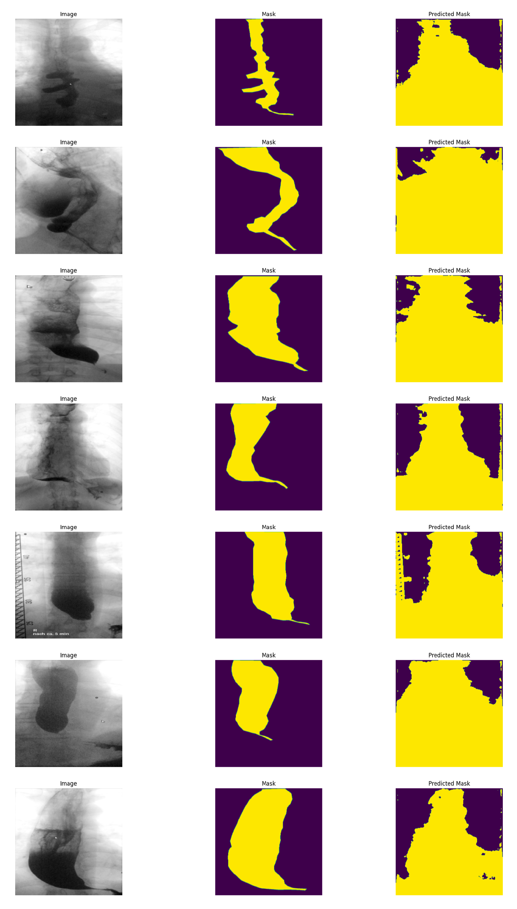

## QG Performance Metrics Selection (TBE Segmentation) 

- Based on [Towards a guideline for evaluation metrics in medical image segmentation](https://bmcresnotes.biomedcentral.com/articles/10.1186/s13104-022-06096-y)

### 1. Interdependency Graph

#### Input Information
> What information is necessary to execute the method and generate the content?

- ##### Related QGs
    > Which stages are required? What pre-requisites exist so the content dimension can be applied?

    [Data Preprocessing]

- ##### AI System Information
    > Which AI system-specific information is relevant so the content dimension can be applied?

    [Developer]

#### Output Information 
> What information is produced that is relevant to other stages and design decisions?

- ##### Related QGs
    > Which stages are impacted and which additional information might be necessary?

    [Model Configuration_RCA-IUnet-BarlowTwins]
    [Optimization] if this configuration is selected

- ##### Post-Market Monitoring Information (Maintenance Stage)
    > Is there relevant information for post-market monitoring?

    - The metrics are relevant when the model is retrained and more annotated data, possibly multi-label, is generated. This event may be triggered by [feedback](../../../4_Maintenance/Support/QG_FeedbackLoops_(TBE_Segmentation).md) on a noticable decline in model performance by the [physician who interacts with the software](../../../../1_System/Stakeholder/3_Passive/Physician_(PassiveStakeholder).md) (e.g. model drift, data drift may occur)

 

### 2. Quality Gate Creation (Design-Decision-Specific Dimensions)

#### Dimension 1: Content
> Which information is generated?

A combination of metrics is selected, interpreted in combination with the segmentation output. All metrics range from 0-1 and should be maximized.

- Dice Score / F1-Score as primary metric  (harmonic mean of sensitivity and precision)
> 0.3966
- Intersection over Union (IoU) / Jaccard Score  (also an F-measure-based metric that stronger penalized over- and undersegmentation)
> 0.2593
- Sensitivity / Recall / True Positive Rate (how well does the model detect the segmented esophagus)
> 0.753
- Specificity / True Negative Rate - highlights functionality - usually expected close to 1 due to high imbalance regarding more pixels belonging to the background than the region of interest
> 0.4233

{width=300 height=}
> RCA-IUnet with Barlow-Twins output on the test set

- RCA-IUnet with Barlow-Twins performance is not convincing with the current state of labeled data
- Comparably high recall is achieved since the model labels a majority of the TBE-image as true class (= esophagus), but misses the correct shape, this behavior is reflected by the calculated IoU and Dice Score

#### Dimension 2: Method
> How is the information generated? 

- Medical images are characterized by high data imabalance: the region of interest (ROI) is comparably less prevalent with respect to the amount of background pixels
- Therefore, true positives (TP) and true negatives (TN) should not be weighted equally

#### Dimension 3: Representation
> How should which information should be presented to which stakeholders and when?

##### Developer

- Interpret the model's overall segmentation performance in combination with the individually generated output masks

 

#### Evaluation
> What are open questions when applying the generated information?

- Other metrics such as Cohen's kappa, or the average hausdorff distance can be appended 
- This bad performance contrasts [BT-Unet: A self-supervised learning framework for biomedical image segmentation using barlow twins with U-net models](https://link.springer.com/article/10.1007/s10994-022-06219-3)
- Possibly, with growing data and hyper-parameter tuning, the approach might outperform nnU-Net, which would necessitate an additional iteration of testing the model (we only have 85 labeled images, their data set comprises multiple hundreds of annotated data samples for fine-tuning)
- This hypothesis is possibly supported based on the fact that specificity is lower than sensitivity, which contradicts the expectation that specificity is usually close to 1 (towards a guideline for medical image segmentation, 6), and as can be seen by the visual representation, the model selects a majority of pixels as esophagus

 

### 3. Additional Information

#### Risk Management

- ##### Poses Risk(s)
    > Are there related risks?

- ##### Implements Risk Control(s)
    > Are there risk controls implemented?

#### ...
