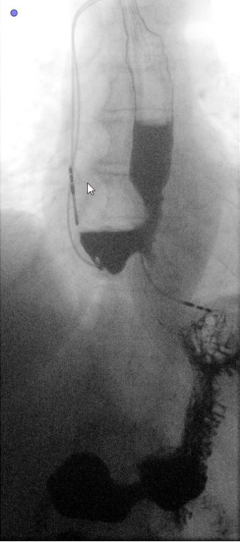

## QG Data Design Input (TBESegmentation) 

### 1. Interdependency Graph

#### Input Information
> What information is necessary to execute the method and generate the content?

- ##### Related QGs
    > Which stages are required? What pre-requisites exist so the content dimension can be applied?

    [Data storage](QG_Acquisition_(Data).md)

- ##### AI System Information
    > Which AI system-specific information is relevant so the content dimension can be applied?

    [Consulting Domain expert (physicians)](../../../1_System/Stakeholder/2_Consulting/Physician_(ConsultingStakeholder).md)

#### Output Information 
> What information is produced that is relevant to other stages and design decisions?

- ##### Related QGs
    > Which stages are impacted and which additional information might be necessary?

    [Data collection](QG_Acquisition_(Data).md)
    [Data Preprocessing](../2_Utilization/2_Preprocessing/QG_DataPreprocessing_(nnU-Net).md)

- ##### Post-Market Monitoring Information (Maintenance Stage)
    > Is there relevant information for post-market monitoring?

    [Model Update - New Data](../../4_Maintenance/QG_Maintenance_(Lifecycle).md)

 

### 2. Quality Gate Creation (Design-Decision-Specific Dimensions)

#### Dimension 1: Content
> Which information is generated?

- Esophagus TBE images as raw medical data (pseudonymized)
- Mask of the annotated esophagus for model training

{width=200 height=}
> Timed-barium esophagogram raw data

{width=200 height=}
> Corresponding mask

#### Dimension 2: Method
> How is the information generated? 

- In cooperation with a physician (consulting stakeholder), the masks are created.

#### Dimension 3: Representation
> How should which information should be presented to which stakeholders and when?

##### Developer
- Developers need to access the growing data set during model training

 

#### Evaluation
> What are open questions when applying the generated information?

Setup to generate a multi-label data set is incorporated within the medical software, this may result in optimized model performance with an augmenting amount of annotated data.
Options include the spine and the barium in addition to the esophagus in the TBE image. As a result, a pixel may belong to multiple labels.

{width=200 height=}
> Update the data set with multi-label annotation setup, e.g. including annotations of the spine, as illustrated.

 

### 3. Additional Information

#### Risk Management

- ##### Poses Risk(s)
    > Are there related risks?

- ##### Implements Risk Control(s)
    > Are there risk controls implemented?

#### ...
