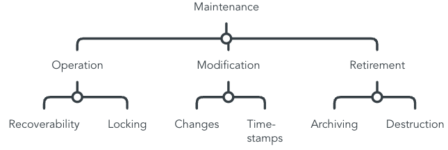

## QG Maintenance (Data)

Data Maintenance addresses information on deploying and operationalizing the data set in production. It is strongly related with [model maintenance](../../../2_Lifecycle/4_Maintenance/QG_Maintenance_(Lifecycle).md).

### Overview Sub-QGs
Exemplary overview of process steps, based on [IEEE Recommended Practice for the Quality Management of Datasets for Medical Artificial Intelligence (IEEEData)](https://ieeexplore.ieee.org/document/9812564), [An artificial intelligence life cycle: From conception to production (CADAC)](https://www.sciencedirect.com/science/article/pii/S2666389922000745) and ISO/IEC FDIS 5338:2023(E) on *Information Technology -- Artifical Intelligence -- AI system lifecycle processes*

> This is only a proposition based on our contribution of this MQG4AI-template.

#### Operation
- Recoverability "for backup and recovery of data sets" (IEEEData, 21)
- Locking "locking of data sets, avoiding unexpected operations, such as modification, deletion, and unauthorized access"  (IEEEData, 21)
- Privacy protection and cyber security "user authorization and encryption methods" (IEEEData, 22)

#### Modification
- "pertinent standard operating procedures should be established to manage data modification." (IEEEData, 22)
- "information obtained applied modifications should be recorded for auditing purposes, whenever possible: pre and post modification condition, time point, executor, inspector, interface (data interface, access interface, etc.), reasons, and modification results" (IEEEData, 22)
- "when the data set is updated, the data set responsible organization should notify the user in some way, such as email, service change subscription" and respect "quality characteristics" (IEEEData, 22)

#### Retirement
- "Data retirement management should be executed when the user makes a request, the contract is terminated, or the data authorization agreement is terminated" (preparation e.g. archiving, destruction of data and storage medium) (IEEEData, 23)
- may be executed in conjunction with model decommissioning or independently, may target the complete data set or data samples