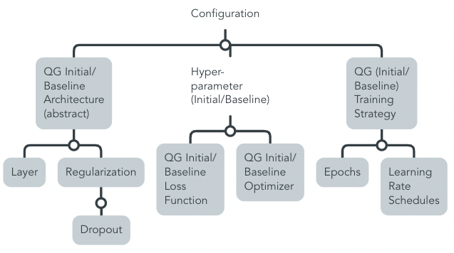

# QG Model Configuration (Development)

This section structures technical information on the model configuration, namely the initial architecture and hyperparameters. Or the baseline architecture that is being optimized for comparison of conceptual methods based on the evaluation of outputs.

Horizontal interdependencies that are relvant for defining the model configuration are related to the [Model Optimization stage](../3_Model_Optimization/QG_ModelOptimization_(Development).md), and [Data Utilization, i.e. quality and pre-processing steps](../../1_Data/2_Utilization/QG_Utilization_(Data).md). 
Also, the training strategy is continued by Optimization influenced by Pre-processing.

Among others, they shape Input- and Output Information of the Interdependency Graph in the [Leaf-QG template](../../../../../templates/Template_LeafQG.md) for design decisions.

Optimization is conceptually monitored by MQG4A-template versions that illustrate different combinations of implementation approaches and how they relate with results. Based on the interpretation of those results, components of the baseline model configuration are continuously updated.

### Overview Sub-QGs

> This is only a proposition based on our contribution of this MQG4AI-template. Identified leaf-QGs are marked grey.