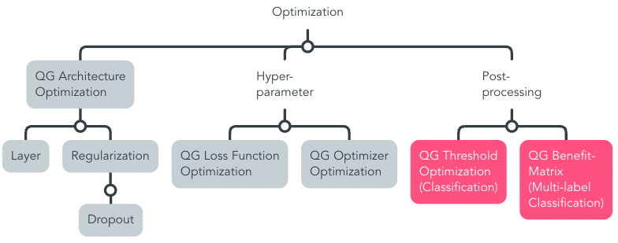

# QG Model Optimization (Development)

> For instance, for the selected model [nn-Unet](../1_Model_Configuration/QG_nnU-Net_(StateOfTheArt).md), the architecture, hyperparameter, and pre-processing steps could be optimized further, in addition to more labeled data.

This section addresses model optimization techniques to update the [initial baseline approach](../1_Model_Configuration/QG_ModelConfiguration_(Development).md) based on the identified [evaluation strategy](../2_Model_Evaluation/QG_ModelEvaluation_(Development).md).

Horizontal interdependencies that are relvant for optimization are related to the [Model Configuration](../1_Model_Configuration/QG_ModelConfiguration_(Development).md), and [Data quality, pre-processing steps and raw/transformed model output](../../1_Data/2_Utilization/QG_Utilization_(Data).md). 

Among others, they shape Input- and Output Information of the Interdependency Graph in the [Leaf-QG template](../../../../../templates/Template_LeafQG.md) for design decisions.

Optimization is conceptually monitored by MQG4A-template versions that illustrate different combinations of implementation approaches and how they relate with results.

The raw *model output* including transformations are appended to the [Data utilization stage](../../1_Data/2_Utilization/QG_Utilization_(Data).md), analoguously to pre-processing, since this is equally generated data that is addressed by other stages, such as optimization.

### Overview Sub-QGs

> This is only a proposition based on our contribution of this MQG4AI-template. Identified leaf-QGs are marked grey, and the proposed QG-compilation for reliable multi-label classification in emergency medicine is colorized pink.