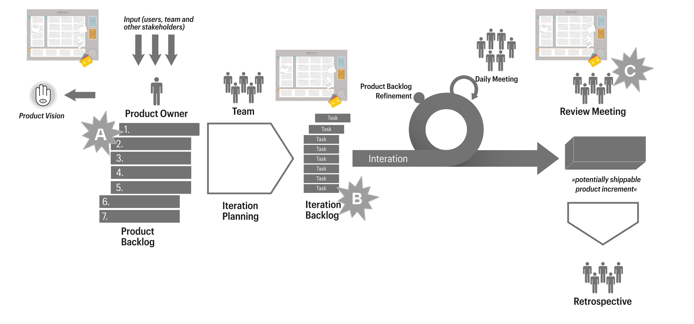
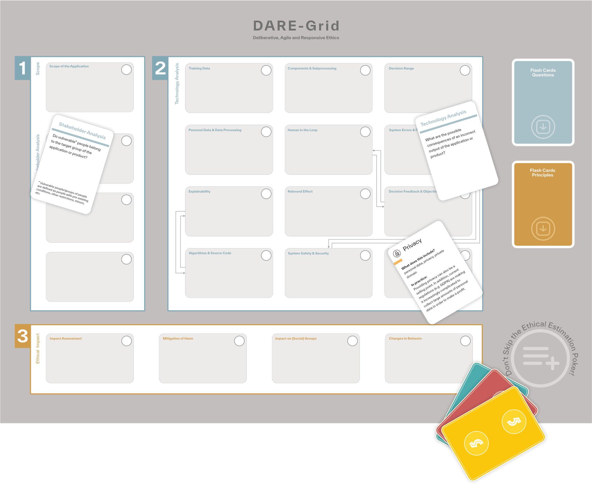

## Ethics Specific - tailored to the Application

This section provides room to integrate ethical discussions centered around AI trustworthiness with respect to the system's real-world application with project planning, as well as to provide project-wide use case-specific information on ethical questions to everyone -- aiming to address the human mindset, which is a crucial component of the AI lifecycle, and poses risks. 

Concrete materials for application of the [DARE-method](https://pubmed.ncbi.nlm.nih.gov/39176659/) can be found [here](https://github.com/tha-digileg/DARE-Method/blob/main/README.md). It provides a gamification-oriented approach for practical ethics training.

> Envisioned ethics embedding with (agile) development, highlighting the iterative character. 
>> - *A* focuses on the "what" of development, addressing the goals, requirements, and overall direction of the product.
>> - *B* emphasizes the "how," concentrating on the processes, methods, and approaches used to achieve the goals.
>> - *C* represents a moment of reflection, conducted before the start of a new iteration, to evaluate and adapt based on ethical and practical insights gained.

> The DARE-grid and flash cards, by focusing on these foundational (abstract) concepts, a comprehensive framework for RAI discussions emerges, constantly evolving in alignment withe project's cycles.

Overall, we aim to provide an approach to consider the following questions focusing on contributing (= active and consulting) stakeholders:
> How are ethical questions interpreted in the context of the individual application, and can be addressed in a continuous manner? Which stakeholder roles need to have which knowledge, in general and with respect to the application?
> And how is ethical information on risks and trustworthiness  interpreted in the context of the individual application?

Refer to [Ethics_General](../../Ethics_General/Ethics_General.md) for basic knowledge on ethics in the context of RAI.

### MQG4AI's Four Fundamental Principles towards Risk Mitigation
In addition, MQG4AI's four fundamental design principles are envisioned to contribute towards risk mitigation by design. They are envisioned as possible "answers" to address the previously introduced RAI qualities that are intended to promote risk analysis (identification and evaluation). 
> How are they realized in the context of the individual application?

 

