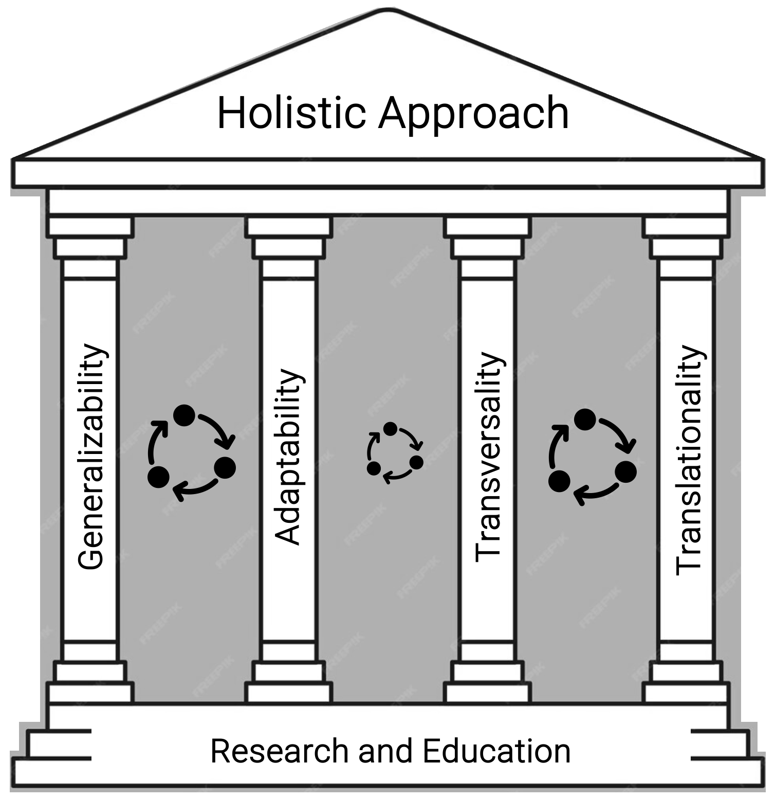

## Ethics General - basic RAI knowledge

This section is intended to provide general information on ethics in the context of RAI to all stakeholders -- aiming to train the human mindset, which is a crucial component of the AI lifecycle, and poses risks. Refer to [Ethics_Specific](../Application/Ethics/Ethics_Specific.md) regarding ethical questions that are tailored to the individual application.

For instance, this information is intended to provide content for ethics training, and we have outlined exemplary starting points for ethical considerations, based on (todo add link paper T).

> What ethical information on risks and trustworthiness should be distributed to all stakeholders? 

### The human influence - A Responsible AI (RAI) mindset
The ethical foundation of the EU AI Act is based on [ALTAI](https://altai.insight-centre.org/), published in 2019 by the High-Level Expert Group on Artificial Intelligence set up by the European Commission, which categorize desired AI ethical qualities into seven categories (Human Agency and Oversight; Technical Robustness and Safety; Privacy and Data Governance; Transparency; Diversity, Non-discrimination and Fairness; Societal and Environmental Well-being; Accountability). They comprise the foundation of our proposed holistic approach, which we intend to shape a RAI mindset of contributing stakeholders who understand possible risks through the lens of their project towards risk identification and evaluation based on these qualities to promote awareness, including the crucial role of research and education in the context of RAI, as introduced here (link paper T):

{width=400 height=}

By examining risks through these ethical lenses, stakeholders can enhance their ability to identify and evaluate risks effectively.

### MQG4AI's Four Fundamental Principles towards Risk Mitigation
In addition, MQG4AI's four fundamental design principles are envisioned to contribute towards risk mitigation by design. They are envisioned as possible "answers" to address the previously introduced RAI qualities that are intended to promote risk analysis (identification and evaluation). Stakeholders are encouraged to reflect on these principles and consider their interpretation and application in their specific contexts: 
> How are they interpreted by you?

