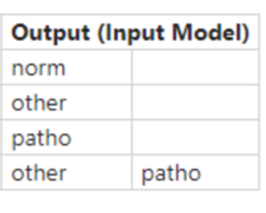
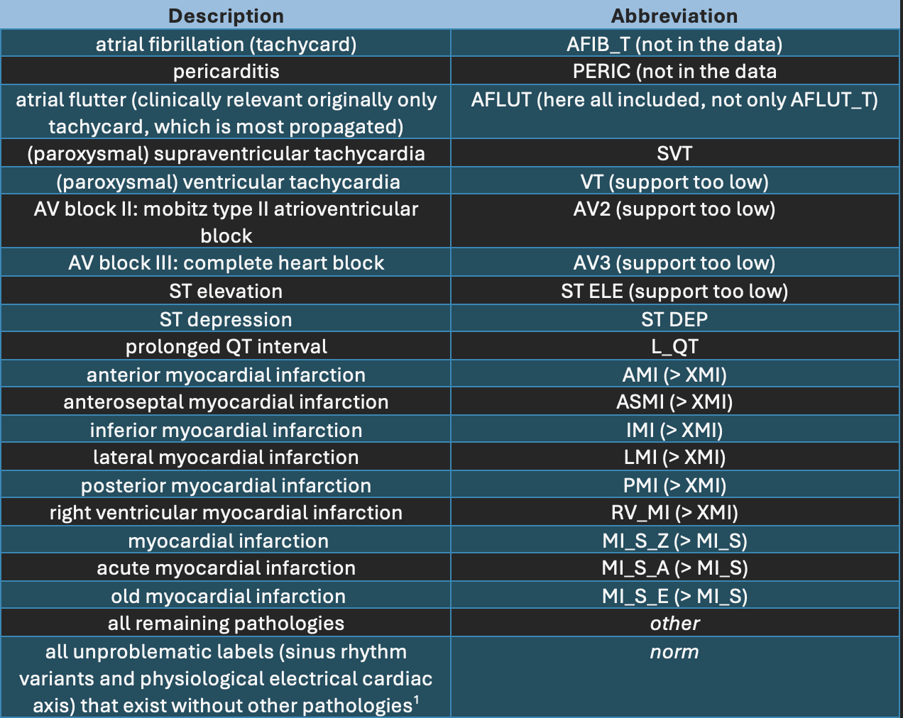

## QG Label Structure (Multi-label Classification Preprocessing)

### 1. Interdependency Graph

#### Input Information
> What information is necessary to execute the method and generate the content?

Domain knowledge to derive a use case-adapted label structure, aiming to adjust an existing more broadly applicable data set to the use case based on a reasonable label count in the existing data

- ##### Related QGs
    > Which stages are required? What pre-requisites exist so the content dimension can be applied?

    - [Data](../../../QG_Data_(Lifecycle).md)
        - [Label count](../../../QG_Data_(Lifecycle).md)

- ##### AI System Information
    > Which AI system-specific information is relevant so the content dimension can be applied?

    - [Application](../../../../../1_System/Application/Application.md)
        - [Use case](../../../../../1_System/Application/Application.md)
    - [Stakeholder](../../../../../1_System/Stakeholder/Stakeholder.md)
        - [Domain expert](../../../../../1_System/Stakeholder/2_Consulting/DomainExpert_(ConsultingStakeholder).md)

#### Output Information 
> What information is produced that is relevant to other stages and design decisions?

A use case-specific label structure based on a domain-embedded interpretation: The intended use of the system defines the desired multi-label classifier output in alignment with a reasonable label count in the data and transforms an existing label structure.

- ##### Related QGs
    > Which stages are impacted and which additional information might be necessary?

    - [Performance evaluation metrics compilation](../../../../2_Development/2_Model_Evaluation/PerformanceMetrics/QG_PerformanceMetricsCompilation_(MultiLabelClassification).md)
    - [Benefit matrix](../../../../2_Development/3_Model_Optimization/PostProcessing/QG_Thresholding_(ClassificationPerformanceMetrics).md)
    - [Tuning objective](../../../../2_Development/2_Model_Evaluation/PerformanceMetrics/QG_Objective_(MultiLabelClassification).md)
    - [Maintenance - new data](../../../../4_Maintenance/QG_Maintenance_(Lifecycle).md)

- ##### Post-Market Monitoring Information (Maintenance Stage)
    > Is there relevant information for post-market monitoring?
    
    - The label count in the data needs to be continuously monitored with evolving data, possibly resulting in adaptations of the label structure based on label support 

 

### 2. Quality Gate Creation (Design-Decision-Specific Dimensions)

#### Dimension 1: Content
> Which information is generated?

- Define the ideal model output for the intended use of the AI system to derive the use case-specific multi-label structure 
- Include a domain-embedded interpretation of the resulting label structure
- Continuously align the label structure with the label count in the data set

##### Example [Multi-Label ECG classification in an emergency setting](../../../../../1_System/Application/example_ECGAlarmingGuardFunctionality_(EmergencyMedicine).md):
The proposed setup of a label structure for Electrocardiogram ECG multi-label classification with an alarming guard functionality is based on an existing open-source data set [Physionet](../../../../2_Development/0_DesignDecisionMaking/OpenSource_Data/QG_Physionet_(MultiLabelECG).md). There, ECG labels correspond to correlated heart arrhythmias/rhythms and other heart diseases. 

> The proposed label structure is designed to group similar labels depending on the clincial follow-up step after a label is predicted

1. Container Labels
From a medical viewpoint, some labels are entirely independent of one another and can coexist. Therefore, and, since there is no label for the absence of ischemic signs in the data, the **container-labels** *norm*, which includes all labels indicating a healthy patient in the absence of other heart diseases or arrythmias, and *other*, which comprises unspecific diagnosis, were introduced.

> ECG diagnosis alone (e.g., ventricular tachycardia) often do not determine whether a and if so which therapy (medication or electrical) follows. Therefore, the use case adapted label structure aims to evaluate labels that lead to immediate preclinical therapy (medication or electrical), i.e., arrhythmias and ischemic signs. All other pathologies are grouped and evaluated together. Thus, if *other* is displayed, further investigation is required. 

2. Label Structure
The resulting label structure and possible combinations are defined below. *Other* and (multiple) pathologies can coexist, *norm* is only predicted in the absence of all other labels

3. Medical Label Structure vs. Data Distribution
The use case adapted label structure is mapped to the open-source [Physionet data](../../../../2_Development/0_DesignDecisionMaking/OpenSource_Data/QG_Physionet_(MultiLabelECG).md) via their [SNOMED CT CODE](https://www.snomed.org/what-is-snomed-ct), which led to some incompleteness since not all, for the medical use case reasonable labels exist in the data.

The following table summarizes the label abbreviations for 20 (and 8) labels based on the label's support in the data. XMI and MI_S are container labels based on similar clinical follow-up steps, and since for the medical context in emergency medicine, the precise localization of the infarction is not relevant. [Per-label metrics](../../../../2_Development/Model_Evaluation/PerformanceMetrics/QG_PerformanceMetricsCompilation_(MultiLabelClassification).md) could not be calculated for PERIC, AFIB_T, several fine-grained ischemia, AV2, AV3, ST ELE, and VT, and they were excluded as a consequence. 

^1 The existence of one of these labels does not automatically signify that the patient is healthy. For instance, a sinus rhythm can be present in addition to a ST elevation that could hint to a cardiac infarction, therefore *norm* only applies when no pathology is present. 

#### Dimension 2: Method
> How is the information generated? (evaluation of content)

- Use case-adapted definition of the classifier's desired output
- The label structure is identified based on domain translation with respect to individual label's meaning in the indetended real-world setting

##### Example [Multi-Label ECG classification in an emergency setting](../../../../../1_System/Application/example_ECGAlarmingGuardFunctionality_(EmergencyMedicine).md):
The extracted label structure is based on the direct clinical follow-up step triggered by a predicted label.

#### Dimension 3: Representation
> Which information should be presented to which stakeholders and when?

Information on the label structure is crucial for anyone who interacts with the intelligent system:

##### - Stakeholder Developer
- continuous model evaluation

##### - Stakeholder User
- reliable application

##### - Stakeholder Quality Manager
- conformity assessment

 

#### Evaluation
> What are open questions when applying the generated information?

The outlined approach is believed to be applicable to structure future annotations of novel data sets, possibly adding additional labels

 

### 3. Additional Information

#### Risk Management

- ##### Poses Risk(s)
    > Are there related risks?

- ##### Implements Risk Control(s)
    > Are there risk controls implemented?

    - Contribution to addressing [unreliable performance evaluation metrics](../../../../../3_RiskManagement/AI_Risks/2_TechnicalRobustnessSafety/Accuracy/UnreliablePerformanceMetrics.md) model's output
