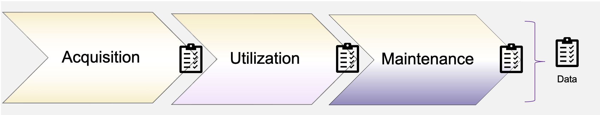

## QG Data (Lifecycle)

The proposed structure is based on the data lifecycle, as proposed in [IEEE Recommended Practice for the Quality Management of Datasets for Medical Artificial Intelligence](https://ieeexplore.ieee.org/document/9812564) to extract high-risk requirements. The structure of process steps is summarized to illustrate a reasonable sequential high-level order, while the proposed sub-QGs need to be refined in alignment with practical experience. The data lifecycle is closely related with other *Lifecycle* stages, and *AI System* information.

{width=800 height=}

We focus on the the model *Development* stage, which is closely related to the data *Utlilization* stage, and especially *Pre-processing* of data for model development. Aiming to avoid [pitfalls](https://pmc.ncbi.nlm.nih.gov/articles/PMC9885377/) such as data leakage,
the data set is split into train / validation / test set before data transformation and augmentation steps.
More details are outlined in the corresponding sub-process QGs.

