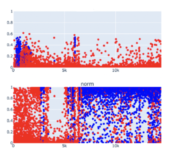

## QG Groundtruth-Probability Distribution (Classification Performance Metrics)

### 1. Interdependency Graph

#### Input Information
> What information is necessary to execute the method and generate the content?

Additional material is intended to shed light on the performance evaluation strategy of classification models. Focusing on assessing the model's confidence, the classifier's predictions (transformed raw model output based on a threshold) on the test set are contrasted with the respective groundtruth.

- ##### Related QGs
    > Which stages are required? What pre-requisites exist so the content dimension can be applied?

    - [Data](../../../../1_Data/QG_Data_(Lifecycle).md)
        - [Groundtruth](../../../../1_Data/2_Utilization/QG_Utilization_(Data).md)
    - [Model output](../../../2_Model_Evaluation/QG_ModelEvaluation_(Development).md)
        - [Model predictions](../../QG_ModelEvaluation_(Development).md)
    - [Model optimization](../../../3_Model_Optimization/QG_ModelOptimization_(Development).md)
        - [Thresholding](../../../3_Model_Optimization/PostProcessing/QG_Thresholding_(ClassificationPerformanceMetrics).md)

- ##### AI System-specific Information
    > Which AI system-specific information is relevant so the content dimension can be applied?

    - [Application](../../../../../1_System/Application/Application.md)
        - [Use case](../../../../../1_System/Application/Application.md)

#### Output Information 
> What information is produced that is relevant to other stages and design decisions?

Monitor the model’s prediction performance and confidence visually to evaluate performance metrics from an additional perspective:
- A visual interpretation of the model's prediction performance and confidence
- Relevant to evaluate performance metrics and classification thresholds

- ##### Related QGs
    > Which stages are impacted and which additional information might be necessary?

    - [Model evaluation](../../../2_Model_Evaluation/QG_ModelEvaluation_(Development).md)
        - [Classification performance metrics](./../QG_PerformanceMetricsCompilation_(Classification).md)
    - [Model optimization](../../../3_Model_Optimization/QG_ModelOptimization_(Development).md)
        - [Thresholding](../../../3_Model_Optimization/PostProcessing/QG_Thresholding_(ClassificationPerformanceMetrics).md)
    - [Maintenance](../../../../4_Maintenance/QG_Maintenance_(Lifecycle).md)

- ##### Post-Market Monitoring Information (Maintenance Stage)
    > Is there relevant information for post-market monitoring?

    - When the model is retrained, additional material needs to be regenerated

 

### 2. Quality Gate Creation (Design-Decision-Specific Dimensions)

#### Dimension 1: Content
> Which information is generated?

Generate data visualizations to assess the classifier's performance, and double-check the performance metric's output for better comprehension of the achieved accuracy and confidence, as well as to define appropriate thresholds for post-processing.

##### Example [Multi-Label ECG classification in an emergency setting](../../../../../1_System/Application/example_ECGAlarmingGuardFunctionality_(EmergencyMedicine).md):
> The groundtruth vs. probability distribution on the test data is displayed (red is 0, blue is 1) for norm (majority class) and general myocardial infarction signs (significantly less frequent in data). As can be deducted, a fixed threshold of 0.5 would lead to the latter almost never being classified as true due to the model’s low confidence. Regarding the majority label norm, the model displays desired tendencies.

{width=400 height=}

#### Dimension 2: Method
> How is the information generated? (evaluation of content)

The groundtruth-probability distribution contributes to additional material, which belongs to the performance evaluation strategy to provide supplementary perspectives towards testing by design.

#### Dimension 3: Representation
> Which information should be presented to which stakeholders and when?

The groundtruth-probability distribution supports stakeholders to interpret classification performance evaluation metrics that are based on a threshold.

##### - Stakeholder Developer
- continuous model evaluation

##### - Stakeholder Quality Manager
- conformity assessment

 

#### Evaluation
> What are open questions when applying the generated content?

 

### 3. Additional Information

#### Risk Management

- ##### Poses Risk(s)
    > Are there related risks?

- ##### Implements Risk Control(s)
    > Are there risk controls implemented?

    - Contribution to addressing [unreliable performance evaluation metrics](../../../../../3_RiskManagement/AI_Risks/2_TechnicalRobustnessSafety/Accuracy/UnreliablePerformanceMetrics.md) additional perspective on the model's confidence in its predictions, which can be used to adjust classification thresholds, for instance

#### ...

