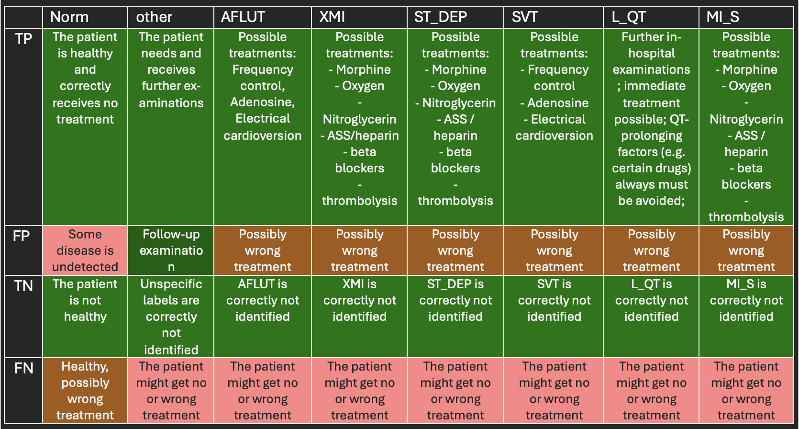

## QG Objective (Mult-label Classification)

### 1. Interdependency Graph

#### Input Information
> What information is necessary to execute the method and generate the content?

Clarify tuning objectives in alignment with the intended use, label structure, and the help of a domain expert.

- ##### Related QGs
    > Which stages are required? What pre-requisites exist so the content dimension can be applied?

    - [Data](../../../1_Data)
        - [Label structure](../../../1_Data/2_Utilization/2_Preprocessing/2_Transformation/QG_LabelStructure_(MultiLabelClassificationPreprocessing).md)
    - [Model evaluation](./..)
        - [Confusion matrix](AdditionalMaterial/QG_ConfusionMatrix_(ClassificationPerformanceMetrics).md)

- ##### AI System-specific Information
    > Which AI system-specific information is relevant so the content dimension can be applied?

    - [Application](../../../../1_System/Application)
        - [Use case](../../../../1_System/Application/Application.md)
    - [Stakeholder](../../../../1_System/Stakeholder)
        - [Domain expert](../../../../1_System/Stakeholder/2_Consulting/DomainExpert_(ConsultingStakeholder).md)
    
#### Output Information 
> What information is produced that is relevant to other stages and design decisions?

Outline how to interpret multi-label classifier output in alignment with the system's intended use to derive domain-embedded tuning objectives for training and optimization, based on a per-label interpretation of the four values of the confusion matrix.

- ##### Related QGs
    > Which stages are impacted and which additional information might be necessary?
    
    - [Model evaluation](../../2_Model_Evaluation/)
        - [Performance Metrics Compilation](./QG_PerformanceMetricsCompilation_(MultiLabelClassification).md)
    - [Model optimization](../../3_Model_Optimization)
    - [Maintenance](../../../4_Maintenance)

- ##### Post-Market Monitoring Information (Maintenance Stage)
    > Is there relevant information for post-market monitoring?

    - Information is relevant to monitor and correctly interpret model evaluation

 

### 2. Quality Gate Creation (Design-Decision-Specific Dimensions)

#### Dimension 1: Content
> Which information is generated?

1. **Baseline**
    Start with *loss minimization* as baseline during model training
2. **Identify use case-specific tuning objectives**
    - Derive a use case-specific interpretation of per-label tuning objectives based on the four values of the confusion matrix
    - Document the meaning of presence and absence of labels with respect to the intended use
3. **Performance metrics compilation**
    Derive a reasonable performance evaluation metrics compilation, and model optimization strategy

##### Example [Multi-Label ECG classification in an emergency setting](../../../../1_System/Application/example_ECGAlarmingGuardFunctionality_(EmergencyMedicine).md):

For multi-label classification, a *Positive* signifies the presence and a *Negative* the absence of a label, which does not necessarily have clinical meaning.

**Interpretation and Tuning Objective** 
The scope of the diagnosis of the intelligent system will in many cases result in clinical follow-up examinations. 
> Overall: the use case-based interpretation results in false alarms (FP) being more acceptable than missing a diagnosis (FN) since non-detection of many labels can lead to heart failure. TP and TN need to be maximized for all labels.
- However, regarding some labels, a false alarm can have devastating consequences for patients. For instance, if an ischemia is falsely diagnosed, unnecessary therapy might follow and lead to serious health risks, especially if a thrombolysis is performed. 

- FP need to be minimized and for some labels they tend to be more acceptable than for others, which depends on the groundtruth. 
- FP-minimization is a clear objective if *norm* is wrongfully predicted, and abnormalities missed. 
- FN need to be avoided, since an abnormality might have been missed or a healthy patient wrongfully treated. 

- If a label in *other* is missed: If such labels are not displayed despite the presence of pathologies, it could result in negative consequences for the patient, as the underlying condition may not be recognized or diagnosed too late.

> Per-label tuning objectives diverge, and depend heavily on the misclassified label, and respective groundtruth 

4. **Consider Medical Label Correlations**
Proposed solution: Data imbalance and cost-Sensitive [Threshold Optimization](../../3_Model_Optimization/PostProcessing/QG_Thresholding_(ClassificationPerformanceMetrics).md) based on a use case-adapted [Benefit Matrix](../../3_Model_Optimization/PostProcessing/QG_BenefitMatrix_(MultiLabelClassification).md)

5. **Consider alternative approaches**
- Clinically different tuning objectives per class 
> Based on the interplay of Precision and Recall for instance, the trade-off between false alarms or missed diseases could be addressed more label-specific. This could include a different thresholding method per label that enhances the desired behavior from a clinical viewpoint.
- A combination of ensemble models, i.e. one model per label.
- New benefit matrix for comparison and a possibly closer real-world adaptation: This could be based on a re-evaluation of the first approach including a clinical prioritization of class labels, for instance.

#### Dimension 2: Method
> How is the information generated? (evaluation of content)

Use case-adaptation of the interpretation of the values in the confusion matrix for each label as foundation to establish and evaluate the chose performance metrics compilation as component of the performance evaluation strategy:

{width=800 height=}

#### Dimension 3: Representation
> Which information should be presented to which stakeholders and when?

- Anyone and everytime when the model performance needs to be evaluated

##### - Stakeholder Developer
- continuous model evaluation

##### - Stakeholder Quality Manager
- conformity assessment

 

#### Evaluation
> What are open questions when applying the generated content?

 

### 3. Additional Information

#### Risk Management

- ##### Poses Risk(s)
    > Are there related risks?

- ##### Implements Risk Control(s)
    > Are there risk controls implemented?

    - Contribution to addressing [unreliable performance evaluation metrics](../../../../3_RiskManagement/AI_Risks/2_TechnicalRobustnessSafety/Accuracy/UnreliablePerformanceMetrics.md) to interpret the desired performance
        - Includes [lack of domain experts](../../../../3_RiskManagement/AI_Risks/5_DiversityNon-DiscriminationFairness/StakeholderParticipation/LackofDomainExpertsCollaborationMechanisms.md)

#### ...

