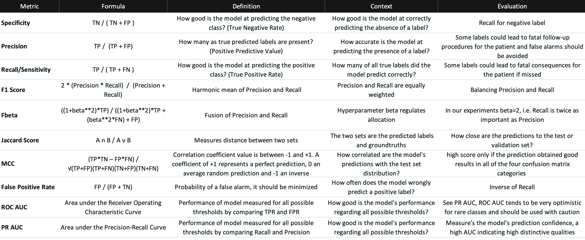
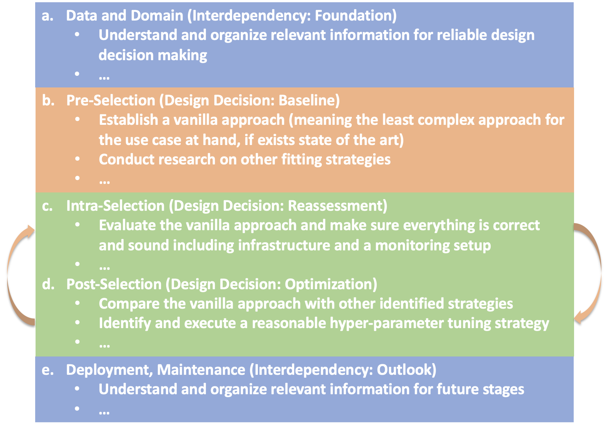

## QG Performance Metrics (Classification)

### 1. Interdependency Graph

#### Input Information
> What information is necessary to execute the method and generate the content?

Performance metrics are the foundation for many other design decisions and should be defined in accordance with the intended use from the start of system conceptualization.

- Structural pre-requisites to define the performance metrics selection address the data distribution, the trained model including transformed predictions based on a classification threshold. 
- Further relevant knowledge comprises a domain-embedded tuning objective, and additional material to visualize model performance. 
- Additional considerations can address model explanations, that offer an additional perspective how to interpret the model's outcome.
- Finally, a process for iterative design decision making is included that aims to establish a solid performance evaluation strategy.

- ##### Related QGs
    > Which stages are required? What pre-requisites exist so the content dimension can be applied?

    - [Data](../../../1_Data/QG_Data_(Lifecycle).md)
        - [Data distribution](../../../1_Data/2_Utilization/QG_Utilization_(Data).md)
    - [Model evaluation](../PerformanceMetrics/)
        - [Confusion matrix](AdditionalMaterial/QG_ConfusionMatrix_(ClassificationPerformanceMetrics).md)
        - [Additional material](./AdditionalMaterial/)
        - [Objective](QG_Objective_(MultiLabelClassification).md)
    - [Model optimization](../../3_Model_Optimization/QG_ModelOptimization_(Development).md)
        - [Thresholding](../../3_Model_Optimization/PostProcessing/QG_Thresholding_(ClassificationPerformanceMetrics).md)
    - [Model explanation](../../4_Model_Explanation/QG_ModelExplanation_(Development).md)
    - [Method](../../0_DesignDecisionMaking/Methods/QG_SelectionMethod_(DesignDecisionMaking).md)

- ##### AI System Information
    > Which AI system-specific information is relevant so the content dimension can be applied?

    - [Application](../../../../1_System/Application/Application.md)
        - [Use case](../../../../1_System/Application/example_ECGAlarmingGuardFunctionality_(EmergencyMedicine).md)
    - [Stakeholder](../../../../1_System/Stakeholder/Stakeholder.md)
        - [Domain expert](../../../../1_System/Stakeholder/2_Consulting/DomainExpert_(ConsultingStakeholder).md)

#### Output Information 
> What information is produced that is relevant to other stages and design decisions?

Generalizable information for binary classification performance metrics:
- A reliable approach for metrics selection including optimization, and assessment, as well as an exemplary metrics complilation for classification scenarios
- Considerations which metric should be monitored during model training
- Receiver Operating Characteristic (ROC AUC) vs. Precision Recall Area under the Curve (PR AUC) evaluation in relation to data imbalance

- ##### Related QGs
    > Which stages are impacted and which additional information might be necessary?

    - [Model Configuration](../../1_Model_Configuration/QG_ModelConfiguration_(Development).md)
    - [Model Optimization](../../3_Model_Optimization/QG_ModelOptimization_(Development).md)
    - [Model explanation](../../4_Model_Explanation/QG_ModelExplanation_(Development).md)
    - [Maintenance](../../../4_Maintenance/QG_Maintenance_(Lifecycle).md)

- ##### Post-Market Monitoring Information (Maintenance Stage)
    > Is there relevant information for post-market monitoring?

    Depending on the label distribution in the data, thresholds need to be adjusted, and additional material continuously monitored for assessing the metrics' performance

 

### 2. Quality Gate Creation (Design-Decision-Specific Dimensions)

#### Dimension 1: Content
> Which information is generated?

A compilation of performance metrics consisting of confusion-matrix and ranking metrics, that are selected with respect to their use case-specific interpretation in the context of classification.
> Objective: 
Metrics selection, as well as definition of the interplay between metrics with respect to the intended real world setting - global comprehension of what it means to select the "best model", or when the model performs "good", and which metric should be optimized during model training

1. **Central Metrics**: 
Depending on the use case, which metrics best mirror the domain-embedded tuning objective(s)?
Closely related is the question which metric to optimize during model training, which can be tested empirically in alignment with these considerations.  

Possible aproach:
> The chosen metric-to-monitor best summarizes the intended real-world objective, and is compared to the baseline *loss minimization*.

2. **Complementary Metrics**: 
Additional perspectives are included for a more comprehensive overview of the model’s performance. How do the metrics behave in relation to one another? Are they aligned?

> **False Positive Rate** and **Specificity** complement the desired tendencies from a different perspective. **Jaccard Score** and **Matthews Correlation Coefficient (MCC)** analyze the outcome distribution in more detail and are included for a more comprehensive overview of the model’s performance. Further, ranking-based metrics are calculated to measure the model’s confidence towards its predictions. 

3. **Metrics suitability assessment (risk control)**:
- The inclusion of additional material, which highlights the data set, supports a more reliable comprehension and should be referenced during metrics planning and interpretation.

- **Receiver Operating Characteristic Area under the Curve (ROC AUC)** should be referenced with caution since it behaves very optimistic compared to the prediction vs. groundtruth label distribution and appears to not accurately mirror the model’s confidence in case of high data imbalance. 
- **Precision Recall Area under the Curve (PR AUC)** appears to mirror the model’s confidence more realistically

Possible Explanation: 
> ROC AUC is highly influenced by the number of True Negatives (i.e. the correctly predicted absence of a label) in the denominator of the False Positive Rate (FPR), while PR AUC focuses on the Positives (Precision) and thus appears more realistic considering the label’s low support in the data.

4. Resulting Metrics Compilation that considers use case, data, and provides a comprehensive overview on the model's performance

The, in the following table presented selection does not claim to be complete and could be optimized through custom metrics, for instance. Also, further domain analysis on disease prevalence and current clinical evaluation tools could provide more information on desired tendencies for metrics selection.

{width=1200 height=}

5. **Metrics optimization strategy (risk control)**:

Data imbalance can be addressed through post-processing thresholding, starting with *0.5* as baseline to transform raw model output into the four values of the confusion matrix.

#### Dimension 2: Method
> How is the information generated? (evaluation of content)

{width=800 height=}

**Pre-Selection** 
Align metrics analysis and selection with use case and data, identify interdependencies

**Intra-Selection**
Assess outlined metrics interpretation with the model's performance under consideration of additional material, and identified interdependencies that may trigger updates

**Post-Selection**
Consider directions for optimization, repeat Intra-, and Post-Selection in alignment with inter-dependencies, and the desired performance

#### Dimension 3: Representation
> Which information should be presented to which stakeholders and when?

Anyone who makes decisions based on model performance assessment, which is relevant for developer that optimize the model and tune hyperparameters, other AI lifecycle design decisions, for user that one day interact with the system, and other stakeholders that consult the model's performance, e.g. for compliance assessment of the required accuracy.

> Guiding Questions:
> - Which metrics are relevant for which stakeholders at what point of the lifecycle?
> - What other stakeholder-views need to be considered?
> - Who has a global overview and is responsible to ensure guidance? What are other responsibilities and who are their representatives for accountability management?

##### Stakeholder

 

#### Evaluation
> What are open questions when applying the generated content?

- Benchmarking: 
a performance comparison with a current clinical state-of-the-art is necessary for optimization and to substantiate the use of AI.
- Explainable AI (XAI):
XAI methods can contribute to a more profound interpretation of the model’s output, and the metric’s performance, as well as additional material
- Include other metrics that measure other characteristics such as fairness, for instance
- A metric that monitors metrics could be designed for surveillance-monitoring support

> Information is extendable to [Multi-label classification performance metrics](./QG_PerformanceMetricsCompilation_(MultiLabelClassification).md), where binary classification metrics are averaged, and label correlations addressed.

 

### 3. Additional Information

#### Risk Management

- ##### Poses Risk(s)
    > Are there related risks?

- ##### Implements Risk Control(s)
    > Are there risk controls implemented?

    - Contribution to addressing [unreliable performance evaluation metrics](../../../../3_RiskManagement/AI_Risks/2_TechnicalRobustnessSafety/Accuracy/UnreliablePerformanceMetrics.md) generalizable guidelines

#### ...
