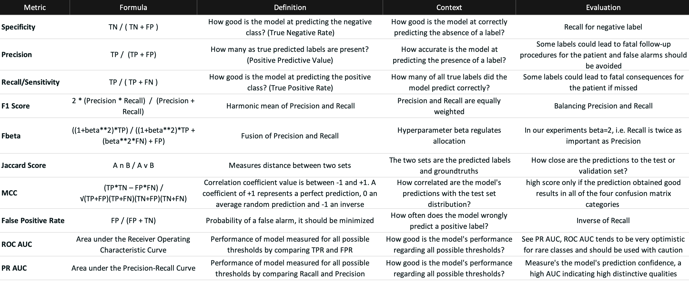
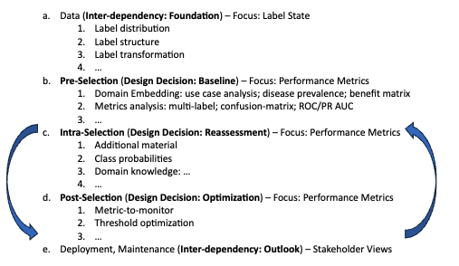

## QG Performance Metrics (Binary-based Multi-Label Classification)

### 1. Interdependency Graph

#### Input Information
> What information is necessary to execute the method and generate the content?

Performance metrics are the foundation for many other design decisions and should be defined in accordance with the intended use from the start of system conceptualization.

- Structural pre-requisites to define the performance metrics selection address the data distribution, the trained model including transformed predictions based on a classification threshold. 
- Further relevant knowledge comprises a domain-embedded tuning objective, and additional material to visualize model performance.
- Additional considerations can address model explanations, that offer an additional perspective how to interpret the model's outcome.
- Finally, a process for iterative design decision making is included that aims to establish a solid performance evaluation strategy.

- ##### Related QGs
    > Which stages are required? What pre-requisites exist so the content dimension can be applied?

    - [Data](../../../1_Data/QG_Data_(Lifecycle).md)
        - [Data distribution](../../../1_Data/2_Utilization/QG_Utilization_(Data).md)
    - [Model evaluation](../PerformanceMetrics/)
        - [Model predictions](../QG_ModelEvaluation_(Development).md)
        - [Additional material](./AdditionalMaterial/)
        - [Objective](QG_Objective_(MultiLabelClassification).md)
    - [Model optimization](../../3_Model_Optimization/QG_ModelOptimization_(Development).md)
        - [Thresholding](../../3_Model_Optimization/PostProcessing/QG_Thresholding_(ClassificationPerformanceMetrics).md)
    - [Model explanation](../../4_Model_Explanation/QG_ModelExplanation_(Development).md)
    - [Method](../../0_DesignDecisionMaking/Methods/QG_SelectionMethod_(DesignDecisionMaking).md)

- ##### AI System Information
    > Which AI system-specific information is relevant so the content dimension can be applied?

    - [Application](../../../../1_System/Application/Application.md)
        - [Use case](../../../../1_System/Application/Application.md)
    - [Stakeholder](../../../../1_System/Stakeholder/Stakeholder.md)
        - [Domain expert](../../../../1_System/Stakeholder/2_Consulting/DomainExpert_(ConsultingStakeholder).md)

#### Output Information 
> What information is produced that is relevant to other stages and design decisions?

- A reliable approach for metrics selection including optimization, and assessment, as well as an exemplary metrics complilation for classification scenarios
- Considerations which metric should be monitored during model training
- Receiver Operating Characteristic (ROC AUC) vs. Precision Recall Area under the Curve (PR AUC) evaluation in relation to data imbalance

Additional information on binary classification metrics selection for the multi-label case:
- Macro-averaged metrics are most reliable, they treat all labels equally and are not influenced by label support in the data set.
- Addressing label correlations that exist in the real world is crucial for binary based multi-label classification. 

- ##### Related QGs
    > Which stages are impacted and which additional information might be necessary?

    - [Model Configuration](../../1_Model_Configuration/QG_ModelConfiguration_(Development).md)
    - [Model Optimization](../../3_Model_Optimization/QG_ModelOptimization_(Development).md)
    - [Model explanation](../../4_Model_Explanation/QG_ModelExplanation_(Development).md)
    - [Maintenance](../../../4_Maintenance/QG_Maintenance_(Lifecycle).md)

- ##### Post-Market Monitoring Information
    > Is there relevant information for post-market monitoring (maintenance)?

    Depending on the label distribution in the data, thresholds need to be adjusted, and additional material continuously monitored for assessing the metrics' performance, including information on class probabilities, and applied averaging methods for the multi-label case.

 

### 2. Quality Gate Creation (Design-Decision-Specific Dimensions)

#### Dimension 1: Content
> Which information is generated?

A compilation of performance metrics consisting of confusion-matrix and ranking metrics, that are selected with respect to their use case-specific interpretation in the context of classification
> Objective: 
Metrics selection, as well as definition of the interplay between metrics with respect to the intended real world setting - global comprehension of what it means to select the "best model", or when the model performs "good", and which metric should be optimized during model training

0. **Averaging Methods** (Additional information for the multi-label case):
Summarize per-label calculated metrics in a single metric for a centralized view on performance evaluation.
    - Macro appears to be the most reliable averaging method for high class imbalance, they treat all labels equally and are not influenced by label support in the data set
    - Weighted could be promising, depending on the applied weights for tuning
    - Micro is influenced by high data imbalance, and can result in rather optimistic outputs
    - Samples might be overfitted to the training data, since various label combinations are possible (similar behavior as micro)

    Possible explanation:
    > Micro-averaging generally achieves higher performance values, which can be misleading. This becomes especially evident when analyzing rare labels with very low support in the data. Specificity, which measures performance regarding the negative class however displays only minor differences compared with macro-averaged metrics. 
    Further, lower thresholds for metrics calculation tend to optimize performance for more macro- than micro-averaged metrics. Lower thresholds comparably lead to more rare labels being classified as positive.

1. **Central Metrics**: 
Depending on the use case, which metrics best mirror the domain-embedded tuning objective(s)?
Closely related is the question which metric to optimize during model training, which can be tested empirically in alignment with these considerations.  

Possible aproach:
> The chosen metric-to-monitor best summarizes the intended real-world objective, and is compared to the baseline *loss minimization*.

2. **Complementary Metrics**: 
Additional perspectives are included for a more comprehensive overview of the model’s performance. How do the metrics behave in relation to one another? Are they aligned?

> **False Positive Rate** and **Specificity** complement the desired tendencies from a different perspective. **Jaccard Score** and **Matthews Correlation Coefficient (MCC)** analyze the outcome distribution in more detail and are included for a more comprehensive overview of the model’s performance. Further, ranking-based metrics are calculated to measure the model’s confidence towards its predictions. 

3. **Metrics suitability assessment (risk control)**:
- The inclusion of additional material, which highlights the data set, supports a more reliable comprehension and should be referenced during metrics planning and interpretation.
> - Append per-label calculations for the multi-label case

- **Receiver Operating Characteristic Area under the Curve (ROC AUC)** should be referenced with caution since it behaves very optimistic compared to the prediction vs. groundtruth label distribution and appears to not accurately mirror the model’s confidence in case of high data imbalance. 
- **Precision Recall Area under the Curve (PR AUC)** appears to mirror the model’s confidence more realistically

Possible Explanation: 
> ROC AUC is highly influenced by the number of True Negatives (i.e. the correctly predicted absence of a label) in the denominator of the False Positive Rate (FPR), while PR AUC focuses on the Positives (Precision) and thus appears more realistic considering the label’s low support in the data.

4. Resulting Metrics Compilation that considers use case, data, and provides a comprehensive overview on the model's performance

The, in the following table presented selection does not claim to be complete and could be optimized through custom metrics, for instance. Also, further domain analysis on disease prevalence and current clinical evaluation tools could provide more information on desired tendencies for metrics selection.

##### Example [Multi-Label ECG classification in an emergency setting](../../../../1_System/Application/example_ECGAlarmingGuardFunctionality_(EmergencyMedicine).md):
> The tuning objective is best mirrored by metrics that balance Recall (= Sensitivity) and Precision, which are combined in a single metric by the F1-/FBeta-Score. Overall, the alarming guard functionality favors not missing critical labels and can be characterized as being more acceptable of false alarms, since they can lead to a clinical follow-up in the intended workflow. However, depending on the respective label and its consequences in a clinical setting, and due to time sensitivity of the chosen measure, this can defer. In addition, common clinical evaluation approaches in the ECG domain that are based on Sensitivity and Specificity, as well as the interpretation of the confusion matrix values support this design decision.

5. **Metrics optimization strategy (risk control)**:

Data imbalance can be addressed through post-processing thresholding, starting with *0.5* as baseline to transform raw model output into the four values of the confusion matrix.

> Address label correlations that exist in the real world is crucial for multi-label classification. The realization is highly use case-dependent

#### Dimension 2: Method
> How is the information generated? (evaluation of content)

{width=800 height=}

**Pre-Selection** 
Align metrics analysis and selection with use case and data, identify interdependencies.
> Append multi-label averaging, as well as a strategy to address label correlations

**Intra-Selection**
Assess outlined metrics interpretation with the model's performance under consideration of additional material, and identified interdependencies that may trigger updates
> In addition, monitor class-probabilities for each label

**Post-Selection**
Consider directions for optimization, repeat Intra-, and Post-Selection in alignment with inter-dependencies, and the desired performance
> Extend the approach with considerations centered around label correlations

##### Example [Multi-Label ECG classification in an emergency setting](../../../../1_System/Application/example_ECGAlarmingGuardFunctionality_(EmergencyMedicine).md):

{width=800 height=}

#### Dimension 3: Representation
> Which information should be presented to which stakeholders and when?

Anyone who makes decisions based on model performance assessment, which is relevant for developer that optimize the model and tune hyperparameters, other AI lifecycle design decisions, for user that one day interact with the system, and other stakeholders that consult the model's performance, e.g. for compliance assessment of the required accuracy.

> Guiding Questions:
> - Which metrics are relevant for which stakeholders at what point of the lifecycle?
> - What other stakeholder-views need to be considered?
> - Who has a global overview and is responsible to ensure guidance? What are other responsibilities and who are their representatives for accountability management?

##### - Stakeholder Developer
- continuous model evaluation

##### - Stakeholder User
- reliable application

##### - Stakeholder Quality Manager
- conformity assessment

 

#### Evaluation
> What are open questions when applying the generated content?

- Benchmarking: 
a performance comparison with a current clinical state-of-the-art is necessary for optimization and to substantiate the use of AI.
- Explainable AI (XAI):
XAI methods can contribute to a more profound interpretation of the model’s output, and the metric’s performance, as well as additional material
- Include other metrics that measure other characteristics such as fairness, for instance
- A metric that monitors metrics could be designed for surveillance-monitoring support

> Inherits from [Classification Performance Metrics](./QG_PerformanceMetricsCompilation_(Classification).md), and extends information relevant for the multi-label case

 

### 3. Additional Information

#### Risk Management

- ##### Poses Risk(s)
    > Are there related risks?

- ##### Implements Risk Control(s)
    > Are there risk controls implemented?

    - Contribution to addressing [unreliable performance evaluation metrics](../../../../3_RiskManagement/AI_Risks/2_TechnicalRobustnessSafety/Accuracy/UnreliablePerformanceMetrics.md) generalizable guidelines

