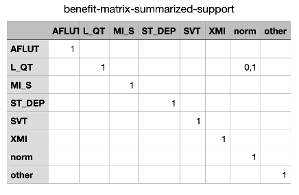

## QG Benefit-Matrix (Multi-Label Correlations ECG Classification)

### 1. Interdependency Graph

#### Input Information
> What information is necessary to execute the method and generate the content?

The selected label structure provides the foundation to compare the groundtruth with the model's predictions.

- ##### Related QGs
    > Which stages are required? What pre-requisites exist so the content dimension can be applied?

    - [Multi-Label Structure](../../../1_Data/2_Utilization/2_Preprocessing/2_Transformation/QG_LabelStructure_(MultiLabelClassificationPreprocessing).md)

- ##### AI System Information
    > Which AI system-specific information is relevant so the content dimension can be applied?

    - [Application](../../../../1_System/Application/Application.md)
        - [Use case](../../../../1_System/Application/Application.md)
    - [Stakeholder](../../../../1_System/Stakeholder/Stakeholder.md)
        - [Domain expert](../../../../1_System/Stakeholder/2_Consulting/DomainExpert_(ConsultingStakeholder).md)

#### Output Information 
> What information is produced that is relevant to other stages and design decisions?

In multi-label classification, the benefit matrix offers a tool to evaluate performance through contributing information to the comparison of predicted labels with the groundtruth:
- The resulting matrix rows and columns contrast every possible combination of predicted labels with groundtruth labels
- The cells are filled with benefit-weights that contribute to the evaluation of correct and incorrect predicitions through adding use case-specific information. 

- ##### Related QGs
    > Which stages are impacted and which additional information might be necessary?

    - [Multi-label performance metrics compilation](../../2_Model_Evaluation/PerformanceMetrics/QG_PerformanceMetricsCompilation_(MultiLabelClassification).md)
    - [Threshold optimization strategy](./QG_Thresholding_(ClassificationPerformanceMetrics).md)
    - [Maintenance](../../../4_Maintenance/QG_Maintenance_(Lifecycle).md)

- ##### Post-Market Monitoring Information (Maintenance Stage)
    > Is there relevant information for post-market monitoring?

   In alignment with changes in the label structure, interpretation, and use case, the benefit matrix changes

 

### 2. Quality Gate Creation (Design-Decision-Specific Dimensions)

#### Dimension 1: Content
> Which information is generated?

Define a use case-adapted logic to fill the benefit matrix

##### Example [Multi-Label ECG classification in an emergency setting](../../../../1_System/Application/example_ECGAlarmingGuardFunctionality_(EmergencyMedicine).md):

> The **Benefit Matrix** is filled based on the medical comparison of predicted labels with their groundtruth focusing on possible negative effects for the patient. 

- For each possible comparison of the groundtruth vs. prediction, the worst case is evaluated, while focusing on the follow-up step directly after the prediction and its consequences for the patient. 
- The closer the treatment, the higher the value – reaching from **0.1 to 1**, which symbolizes complete equality of groundtruth and prediction. 
- The scale applied for the label comparison regarding the benefit matrix is based solely on medical impacts, other considerations such as costs, for instance were not included:

    1: different treatment with severe negative impact
    5: different treatment with moderate negative impact
    9: nearly identical treatment with mild negative impact
    10: identical treatment without impact

- If two labels are not comparable from a medical viewpoint, the value of their misdiagnosis is referenced with the *container-label norm*, which signifies a healthy patient. Then, the the minimum benefit value (worst case) was selected and 0.1 subtracted (if the respective value is >0.1) to include more severeness than compared to an actual misdiagnosis with the *container-label norm*. 

> **Explanation** In both cases, the respective groundtruth would have stayed hidden and no, or the wrong medical therapy would have been induced, in addition to missing another medical condition, which was interpreted as worse. The resulting benefit matrix for 8 labels is illustrated blow. The vertical axis refers to the groundtruth and the horizontal axis represents the model’s prediction.  For instance, if the model wrongfully predicts a healthy sample but the grounhdtruth is L_QT, the least similar tratment is anticipated, which results in a benefit-value of 0.1.

An illustration of the resulting benefit matrix: 
{width=600 height=}

#### Dimension 2: Method
> How is the information generated? (evaluation of content)

Use case-adaptation of the interpretation of incorrect and correct predictions 

##### Example [Multi-Label ECG classification in an emergency setting](../../../../1_System/Application/example_ECGAlarmingGuardFunctionality_(EmergencyMedicine).md):
- Procedure is based on the [Physionet open-source data benefit matrix](https://github.com/physionetchallenges/evaluation-2021). 
- The label struture and benefit-weights are adapted to the intended use of the intelligent system

#### Dimension 3: Representation
> Which information should be presented to which stakeholders and when?

##### - Stakeholder Developer
- continuous model evaluation

##### - Stakeholder User
- reliable application

##### - Stakeholder Quality Manager
- conformity assessment

 

#### Evaluation
> What are open questions when applying the generated content?

- Different variations how to fill the benefit matrix can be tested and compared with other methods how to include label correlations 
- The benefit matrix contributes to the system's evaluation strategy 

 

### 3. Additional Information

#### Risk Management

- ##### Poses Risk(s)
    > Are there related risks?

- ##### Implements Risk Control(s)
    > Are there risk controls implemented?

    Contribution to addressing [unreliable performance evaluation metrics](../../../../3_RiskManagement/AI_Risks/2_TechnicalRobustnessSafety/Accuracy/UnreliablePerformanceMetrics.md) domain-embedded consideration of multi-label correlations, which includes the risk [lack of domain experts](../../../../3_RiskManagement/AI_Risks/5_DiversityNon-DiscriminationFairness/StakeholderParticipation/LackofDomainExpertsCollaborationMechanisms.md)