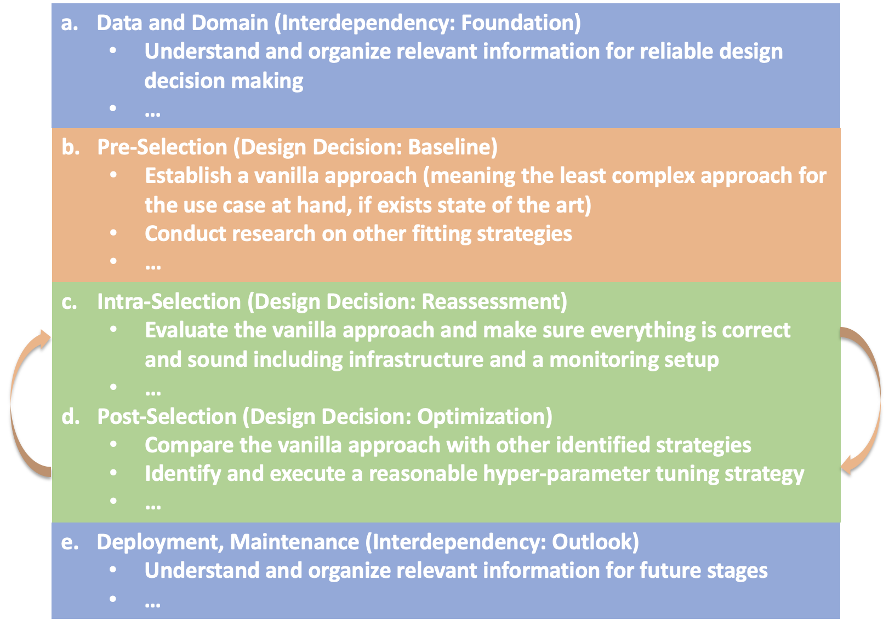

## QG Thresholding (Classification Performance Metrics)

### 1. Interdependency Graph

#### Input Information
> What information is necessary to execute the method and generate the content?

For data imbalance, the fixed threshold of *0.5* to transform raw model output for confusion-matrix-based classification metrics is not suitable. Different thresholding methods exist, that are evaluated in alignment with the performance evaluation and optimization strategy.

- ##### Related QGs
    > Which stages are required? What pre-requisites exist so the content dimension can be applied?

    - [Data](../../../1_Data/QG_Data_(Lifecycle).md)
        - [Data distribution](../../../1_Data/QG_Data_(Lifecycle).md)
    - [Model evaluation](../../2_Model_Evaluation/QG_ModelEvaluation_(Development).md)
        - [Domain-embedded tuning objective](../../2_Model_Evaluation/PerformanceMetrics/QG_Objective_(MultiLabelClassification).md)
        - [Model predictions](../../2_Model_Evaluation/QG_ModelEvaluation_(Development).md)
        - [Performance metrics compilation](../../2_Model_Evaluation/PerformanceMetrics)
            - [Additional material](../../2_Model_Evaluation/PerformanceMetrics/AdditionalMaterial)
    - [Model optimization post-processing](../QG_ModelOptimization_(Development).md)
         - [Benefit matrix](./QG_BenefitMatrix_(MultiLabelClassification).md)    
    - [Model explanation](../../4_Model_Explanation/QG_ModelExplanation_(Development).md)
   
    - [Design decision making method](../../0_DesignDecisionMaking/Methods/QG_SelectionMethod_(DesignDecisionMaking).md)

- ##### AI System Information
    > Which AI system-specific information is relevant so the content dimension can be applied?

    - [Application](../../../../1_System/Application)
        - [Use case](../../../../1_System/Application/Application.md)
    - [Stakeholder](../../../../1_System/Stakeholder)
        - [Domain expert](../../../../1_System/Stakeholder/2_Consulting/DomainExpert_(ConsultingStakeholder).md)

#### Output Information 
> What information is produced that is relevant to other stages and design decisions?

Objective: enhance the model’s prediction performance and confidence through structural adjustments

- Post-processing threshold optimization addresses the effects of high data imbalance 
- Include label correlations for multi-label classification:
    - use case-adjusted thresholds

- ##### Related QGs
    > Which stages are impacted and which additional information might be necessary?

    - [Model Configuration](../../1_Model_Configuration/QG_ModelConfiguration_(Development).md)
    - [Model Optimization](../QG_ModelOptimization_(Development).md)

- ##### Post-Market Monitoring Information (Maintenance Stage)
    > Is there relevant information for post-market monitoring?

    - The success of applied thresholding methods depends on data and domain knowledge that needs to be continuously monitored, including possible additional hyperparameters

 

### 2. Quality Gate Creation (Design-Decision-Specific Dimensions)

#### Dimension 1: Content
> Which information is generated?

1. **Baseline** 
Start with a fixed threshold of *0.5* as baseline
2. **Use case-independent alternatives**
Calculate use case-independent ranking-metrics based thresholds (PR AUC and ROC AUC)
3. **Use case-specific options**
Consider a domain-embedded approach 
4. **Evaluation**
Define the most fitting approach (possibly a combination for the multi-label case) in alignment with the identified interdependency graph to kickstart updates when required. This could be based on the comparison of calculated threshold values with additional material that highlights the model's prediction confidence.

> Guiding Questions:
Which thresholding method is best suited for the use case at hand? 
Is there a suitable domain-embedded approach?

##### Example [Multi-Label ECG classification in an emergency setting](../../../../1_System/Application/example_ECGAlarmingGuardFunctionality_(EmergencyMedicine).md):

- Use case-specific approach:
A combination of class-imbalance and cost-sensitive thresholding (CIST), as outlined in [Y. Liu et al., Automatic Multi-Label ECG Classification with Category Imbalance and Cost-Sensitive Thresholding, Biosensors, 2021.](https://www.ncbi.nlm.nih.gov/pmc/articles/PMC7855348/)
    - Misclassification costs are calculated based on a **benefit matrix**
    - The interplay between class imbalance and misclassification costs is regulated by the **hyperparameter modulating alpha** ranging from *0−1*: class imbalance has *alpha* and the misclassification costs *1 − alpha* influence on the calculated thresholds

- Threshold value evaluation: 
    - ROC-based thresholds are seemingly suitable only for the majority class. 
    - PR-thresholds as well as Fixed (0.5) enhance Precision, since predicting a positive is rare if the model is not confident enough based on the comparably high thresholds. 
    - CIST appears suitable for rare classes, thanks to its low but reasonably distributed thresholds over all labels in line with their respective support.

- Performance metrics evaluation: 
    - CIST (domain-embedded) seems to globally perform best and to be most reasonably distributed across the metrics compilation. 
    - For CIST and PR, the metric value distribution appears to be balanced, though both tend to optimize opposite objectives: Recall and false alarms for the former, versus Precision and missing labels for the latter. 
    - ROC and Fixed display a high and more extreme variance. Macro-averaged metrics display a higher variance than micro. This could be based on the prevalent influence of the majority classes. Monitoring F1- versus FBeta-Score impacts performance in a fine-grained way. 

 The following table illustrates threshold evaluation in relation with additional material, visualizing groundtruth vs. prediction distribution.

#### Dimension 2: Method
> How is the information generated? (evaluation of content)

Empirical comparison of different thresholding methods, embedded within the performance evaluation and optimization strategy, following the design decision making method:

{width=800 height=}

#### Dimension 3: Representation
> Which information should be presented to which stakeholders and when?

Threshold optimization is a technical approach and relevant for active stakeholders that participate in development and maintenance of the model

 

#### Evaluation
> What are open questions when applying the generated content?

Each thresholding method displays significant differences in their effects, and their performance needs to be tested for different use cases, so that the guidelines in the example section can be generalized.

 

### 3. Additional Information

#### Risk Management

- ##### Poses Risk(s)
    > Are there related risks?

- ##### Implements Risk Control(s)
    > Are there risk controls implemented?

    Contribution to addressing [unreliable performance evaluation metrics](../../../../3_RiskManagement/AI_Risks/2_TechnicalRobustnessSafety/Accuracy/UnreliablePerformanceMetrics.md) consideration of domain knowledge and data imbalance for threshold calculation of classification performance metrics, which includes the risk [lack of domain experts](../../../../3_RiskManagement/AI_Risks/5_DiversityNon-DiscriminationFairness/StakeholderParticipation/LackofDomainExpertsCollaborationMechanisms.md)

