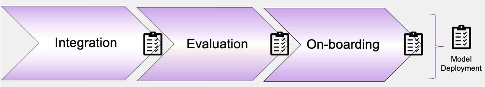
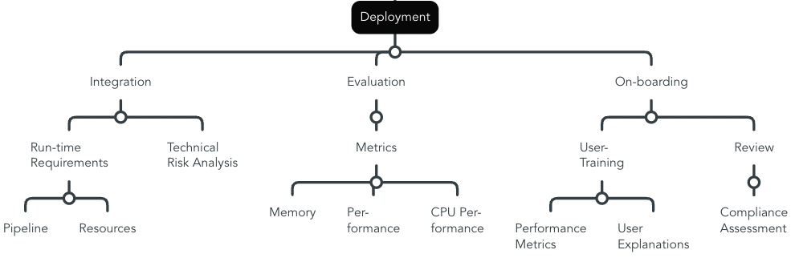

# QG Deployment (Lifecycle)

The *Deployment* section is not focus of our current contribution, and needs to be refined with further empirical experience, including dependencies with other AI quality management sections.

{width=800 height=}

During *Deployment*, the intelligent system enters its intended environment in the real world, which comprises additional tests regarding technical and human-level integration, e.g. clinical trials. Iterations of the technical components of this stage are closely related with *MLOps* during *Maintenance*, aiming to automate the delivery of new model updates.

In addition, it is related to *Development*. For instance, *Performance Metrics* are relevant, for instance for system evaluation in its production environment, as well as during user-trainings towards a trustworthy interpretation of the model's outcomes, depending on the use case.

- "Also known as model serving, model scoring, and model production, in this stage, the evaluated model is deployed for operational use" (CADAC, 8).
- "This process moves the system in an orderly and planned manner into its operational status, such that it is functional, operable and compatible with other operational systems" (ISO5338, 27)
- It "[...] is installed, released or configured for operation in a target environment" (ISO 22989, 39).
- "The primary considerations of deployment are real-time versus batch use of the AI model, the number of end-users and types of applications, the expected formats of output, the expected turnaround time, and the frequency of use" (CADAC, 8).
- "It includes preparing applicable storage, handling and shipping enabling systems" (ISO5338, 28)

### Overview Sub-QGs
Exemplary overview of process steps, based on [An artificial intelligence life cycle: From conception to production (CADAC)](https://www.sciencedirect.com/science/article/pii/S2666389922000745), ISO/IEC FDIS 5338:2023(E) on *Information Technology -- Artifical Intelligence -- AI system lifecycle processes*, and ISO/IEC 22989:2022 on *Information technology — Artificial intelligence — Artificial intelligence concepts and terminology*

> This is only a proposition.

#### Integration
- "Because of operational requirements, AI models can be deployed in a different format from how they were developed" (ISO5338, 28)
- "There is often a difference between the actual AI system that runs the model and the model itself -- where the latter is a configuration or a set of parameters (e.g. the weights of the neural network)" (ISO5338, 28)
- Sometimes, "[...] runtime models are different from the models that are used in development, because the development environment is not compatible with runtime requirements" (ISO5338, 31)
- Therefore, deployment "[...] should aim to support model updates [...] and the execution of continuous monitoring of established metrics associated with the use of the AI system" (ISO5338, 28) (- may include on-boarding to train users)
- "Models are deployed either in batch mode or in continuous mode, depending on whether the AI system has direct need for the model results" (ISO5338, 31)
- Further, "[m]odels can be deployed separately based on the specific runtime requirements of either hardware or software environment or both" (ISO5338, 31)
- For instance, resources for deployment (and development) range from "[...] centralized cloud services and non-cloud data centres to servers (or clusters of servers), edge computing systems, mobile devices and IoT devices" (ISO22989, 50)

#### Evaluation
- "The organization should assess how performance of the AI system can be affected after it has been put into use and, by allowing for such factors, design appropriate monitoring metrics" (ISO5338, 28) (this is linked to the evaluation stage of development, where fitting metrics are identified)
- Evaluating a successful deployment stage can include systems integration testing (ISO22989, 39)
-   "Aligning with the preliminary risk assessment, a technical risk classification and analysis must be conducted in this stage as
the AI model now integrates with external systems and processes when deployed. This stage also extends the initial deliberation of AI ethics, governance, and regulation into the deployment phase. The risks posed by the AI deployment should cover all stakeholders, oraganizational functions, government
regulation, social norms, and any other societal implications following deployment. A risk register and risk assessment matrix
can be used to further evaluate the criticality of each risk and document potential actions and mitigation strategies." (CADAC, 8)

#### On-boarding
- "Specifically in healthcare, further investigations in the form of observational studies, small-scale clinical trials, training, and user-acceptance exercises will be conducted" (CADAC, 9)
- In addition, "[d]epending on the industry sector and scope of project, an expert panel, steering committee, or regulatory body, will conduct a technical and ethics review of the entire project, from a datasets approach, AI model, to evaluate metrics and
effectiveness. Compliance, standardization, post-implementation documentation, contracts, and service level agreements will also be administered in this stage." (CADAC, 9)
- Finally, "[i]n this stage, the team would also consider the legal protection of intellectual property in the form of patenting or the alternatives of trade secrecy that provides continuing protection (as patents expire) or defensive publications in academic journals that contribute toward the advancement of the discipline." (CADAC, 9)