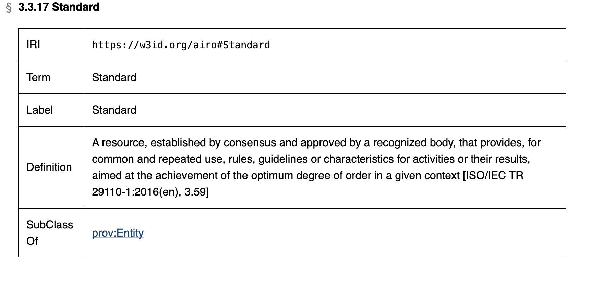

### Risk Control (RiskManagement)

### AI System (AIRO)

/Control.png>){width=800 height=}

- control (= risk management measure).modifies event (event)

→ Risk control measures can reduce severity and/or likelihood (= probability of occurrence) of harm
→ They need to be verified (design and processes can serve as risk control verification, e.g. the risk control is based on a standard)

For the iterative and continuous Risk Management Process:
→ identify risks arising from risk controls (= residual risks)
→ define completeness of risk controls

#### Risk Control Relations

##### - Composition
- control.is part of control (specifies the composition of controls)

##### - Order
- control.is followed by control (specifies the order of controls)

#### Risk Control Functionality

##### - Detection
- control.detects event (indicates the control used for detecting an event)

##### - Information 
(to user - lowest level of risk mitigation)

##### - Modification
- control.modifies event
- control.eliminates event
- control.mitigates event

#### The role of Standards (AIRO)

{width=800 height=}

→ Standards and guidelines can support an inherently safe design and system design processes
