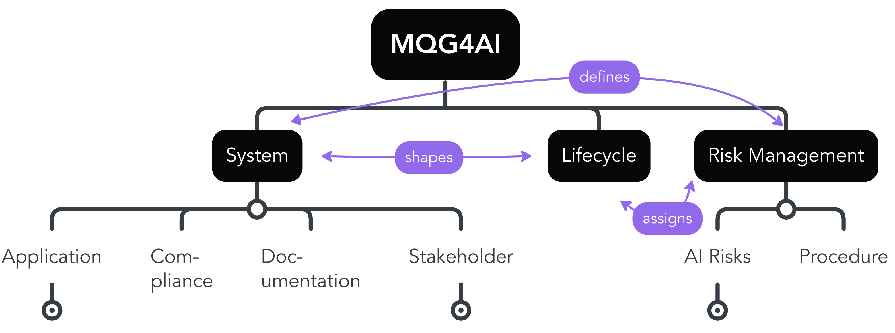
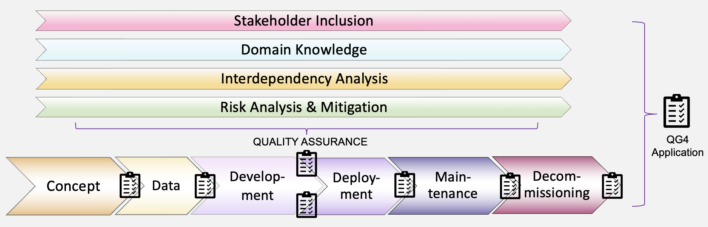
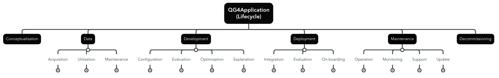
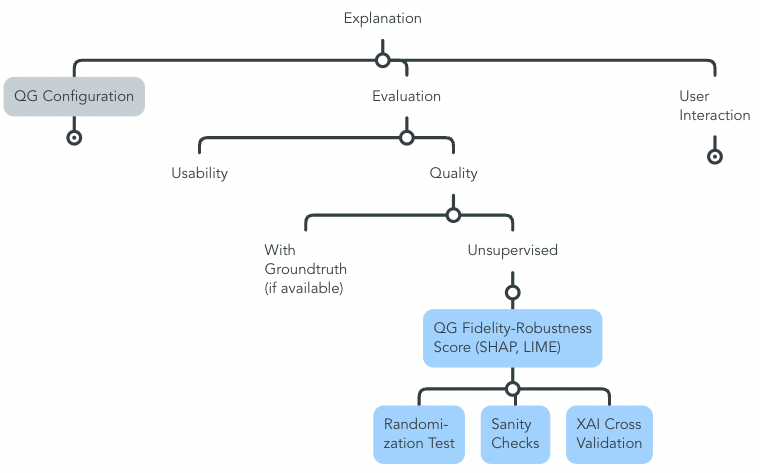
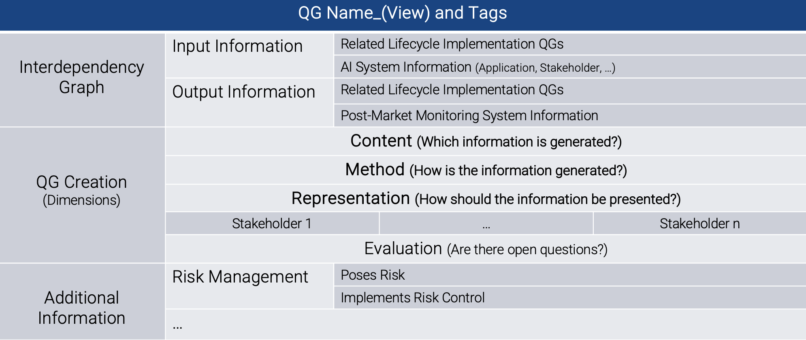
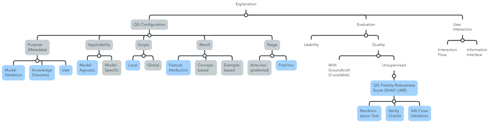
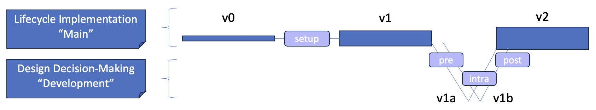

# MQG4AI

Addressing the dynamic state of AI design knowledge, this blueprint is intended to offer a structure for organizing novel, and existing AI knowledge contributions on reliable approaches by the scientific community, as well as the industry. Simultaneously, we aim to support the implementation of AI systems for application by AI providers. Long-term, this setup is envisioned to contribute to implementing [Responsible AI (RAI)](https://www.sciencedirect.com/science/article/pii/S1566253523002129) systems at the interface of regulation and implementation towards realizing compliant and trustworthy AI (TAI). 
AI system-specific *Lifecycle* information management, based on our proposed generic and customizable *Methodology based on Quality Gates towards Certifiable AI* (MQG4AI), is related with regulatory requirements, focusing on risk management and AI system-specific information. 
The repository is a work in progress, and further completing the MQG4AI information blocks with generalizable information across all high-risk AI systems is part of ongoing research, and envisioned to continue in a decentralized manner once the basic blueprint information sturcture is finalized. Envisioned contribution scenarios are outlined below. Refer to [related work](./RelatedWork.md) for an overview of related publications. 

## Towards Responsible AI

Overall, the proposed lifecycle blueprint is envisioned to provide a unifying approach that bridges the gap between practical implementation, ethics and regulation (RAI) based on generic and customizable *Quality Gates* (QG). They comprise the fundamental building block of MQG4AI and are described in more detail below. 
We are convinced that every *Lifecycle* design decision contributes to ensuring the desired quality of AI systems, and we focus on AI knowledge management to monitor the dynamic and use case-specific *Lifecycle* information, starting from the *Development* stage. Addressing regulatory requirements, we focus on the identification of AI risks, structured according to Trustworthy AI (TAI) requirements [ALTAI](https://digital-strategy.ec.europa.eu/en/library/ethics-guidelines-trustworthy-ai) via [Risk Management](./MQG4DesignKnowledge/3_RiskManagement/AI_RiskManagement.md), and linking with [AI System](./MQG4DesignKnowledge/1_System/AI_System.md)-specific information within QG-creation along the [AI lifecycle](./MQG4DesignKnowledge/2_Lifecycle/AI_Lifecycle.md). 

> **Assumption**:
> The AI System is interpreted as the sum of all underlying processes and design decisions. 
    >> QGs are mapped along the *Lifecycle* and mirror design decisions, aiming to continuously supervise conceptual information, while highlighting interdependencies through the extraction of input and output information. The generic and customizable QG-format is based on a three-fold structure at its core, while providing customizability through the option to append additional layers for further information extraction.

The, at the current state extracted information flow between the three identified sections is illustrated as follows - all sections communicate with one another:

{width=800 height=}

System information:
- Defines risk management information
    - e.g. the application's area of impact helps identify potential risk sources (risk analysis), specific stakeholder roles may be more prone to system misuse (risk analysis), and implemented standards towards compliance may result in risk mitigation (risk control)
- Shapes the lifecycle implementation
    - e.g. domain knowledge surrounding the application is relevant for design decision-making

Risk Management:
- Defines system information
    - e.g. the risk management system needs to be documented, and identifying and monitoring relevant information is part of the proposed MQG4AI-template structure (documentation), and ethics training of contributing stakeholders may be part of implemented risk controls addressing the human influence, as well as continuous learning (stakeholder)
- Assigns information to the lifecycle implementation
    - e.g. the implementation of risk controls needs to be continuously monitored, which necessitates observing generated results
    
Information on the lifecycle implementation:
- Shapes system information
    - e.g. a post-market monitoring system needs to be implemented and documented, as well as information on the system's accuracy communicated to the user (documentation)
- Assigns information to risk management
    - e.g. a compilation of design decisions may function as risk controls/risk source

 

> Four fundamental principles of MQG4AI design towards overall risk mitigation (they are closely tied to [general](./MQG4DesignKnowledge/1_System/Ethics_General/Ethics_General.md) and [use case-specific](./MQG4DesignKnowledge/1_System/Application/Ethics_Specific/Ethics_Specific.md) ethical questions):
>> 1. **Domain-Embedding** - the true success can only be measured in the ever evolving real world, and domain-adaptation contributes towards interpretability.
>> 2. **Stakeholder Inclusion** - a diverse compilation of stakeholders enables a comprehensive perspective on the designed AI system and its impact, promotes trustworthiness, while addressing AI literacy among all stakeholders.
>> 3. **Interdependency Analysis** - sheding light on lifecycle-specific interdependencies ensures a robust implementation.
>> 4. **Risk Analysis & Mitigation** - all of the above contribute to a comprehensive risk analysis and mitigation, which is very dynamic, use case-specific, and necessitates addressing the black box character of complex AI techniques from various application-specific perspectives regarding the desired function in the real world.

### Decentralized AI Knowledge Contributions and Application
Aiming to address the continuously evolving dynamics of AI knowledge generation, including the multitude of existing approaches, our proposed setup is based on principles from [Design Science Research](https://www.researchgate.net/publication/345430098_Introduction_to_Design_Science_Research), i.e. the communication of an abstract design knowledge base and concrete application scenarios to test, extend, and update RAI design knowledge in a decentralized manner:

- The **public MQG4DesignKnowledge (MQG4DK)** is envisioned to summarize the ever evolving and dynamic AI design knowledge based on the unifying QG-format focusing on the AI *Lifecycle*, while relating design decision-making with other relevant information towards RAI design decision-making. MQG4DK is intended to grow in a decentralized manner, and we start to design the foundational, living lifecycle blueprint structure. Envisioned contribution scenarios are outlined below.
- The **private MQG4Application (MQG4A)** is intended to provide a qualitative, and use case-specific AI *Lifecycle* conceptualization template(s), which is embedded within *AI System*-specific, and related implementation with identified AI risks. MQG4A is envisioned to function as an additional management layer during AI projects, focusing on iterative *AI Lifecycle* design decision information management and linking towards RAI by design through different template versions. An exemplary compilation of [MQG4A versions](./MQG4Application/) is appended.
    > The use case-adaptation of the MQG4A template(s) is envisioned to be realized by a configurable pull version from MQG4DK (MQG4A-v0), which is tailored to individual AI systems through an intelligent search that identifies relevant information-tags. As a result, only use case-specific *Lifecycle* design decisions, and related relevant information for high-risk systems are pulled from the design knowledge base. This is based on the [Git Branching Structure](https://git-scm.com/book/en/v2/Git-Branching-Branches-in-a-Nutshell).

  

## *Quality Gate* (QG) for *Lifecycle* Information Management

The concept is derived from traditional software engineering and project development, adapted to the AI context, and designed to incorporate AI-specific dynamics for high-quality information management, transformation and extraction. Their setup is intended to address the interface of development and regulation through linking relevant information with other *Lifecycle* QGs, related risks and system information, as well as customizable additional information.

### QG-Graph along the *AI Lifecycle*
QGs are characterized by a hierarchical structure from abstract and generic high-level QG-collections through multiple sub-level QG-collections to use case-specific leaf-QGs. Through the unifying QG-naming structure and customizable QG-creation information formatting, they extract interdependencies in form of a project-specific QG-graph structure with bi- and uni-directional information connections between related QGs that mirror the individual *Lifecycle*, and other relevant information surrounding the *AI System*, and *Risk Management*. The root-node *QG4Application* is envisioned to summarize evaluation scenarios that process comprehensive information on all *Lifecycle*-QGs. 

The **Conceptualization** stage is the starting point of MQG4A, and serves to fill in the template with relevant QGs, related with project-specific system information, based on MQG4DK. Overall, this section is envisioned to monitor updates of iteration cycles, and different MQG4A-template versions, aiming to provide shared knowledge to all stakeholders, and to offer a structure for further project-specific knowledge contributions. 

#### High-level Collection-QGs
Collection-QGs summarize and structure their related *sub-QGs*. They can include up to $n$ sub-QG levels that are either collection- or leaf-QGs (see QG-format for a horizontal view on shared knowledge contributions to the same AI technique illustrated for the *Development* stage) and realize the transition from generic process stages to use case-specific design decisions as the proposed MQG4AI information structure. They build the QG-Graph and identify vertical interdependencies that are envisioned to be generalizable across use cases for the AI lifecycle, while their respective leaf-QGs provide more use case-specific information tailored to specific AI techniques.

> **Example explainable AI (XAI) metrics**:
> Multiple metrics with different objectives exist, and they are relavant at different stages along the AI lifecycle. Here, the vertical QG-graph for XAI-metrics is depicted, focusing on quality evaluation metrics for explanations without an existing groundtruth. Appending a concrete implementation guideline for MQG4DK, the path results in a possible leaf-QG implementation for the evaluation of two specific XAI-methods (SHAP, LIME) that are relevant during the *Development* stage to assess their applicability. This implementation-guideline will only be part of MQG4A, if SHAP and LIME explanations are included in the configuration, while the Collection-QGs contribute to the default-template, since applied explanations need to be evaluated. The related MQG4DK leaf-QG is illustrated [here](./MQG4DesignKnowledge/2_Lifecycle/2_Development/4_Model_Explanation/Method_Evaluation/Quality/QG_FidelityRobustnessScore_(SHAPLIME).md).

#### Generic and Customizable Leaf-QG-Format
QGs mirror *AI Lifecycle* design decisions, which combined result in the intelligent system. At their core, QG-creation is based on a three-fold structure, which is related to relevant input, and output information aiming to enable a comprehensive interdependency analysis towards testing by design of acceptable implementation approaches. Further, additional layers are intended to bridge the gap to overall information management towards a compliant application.

> Our starting point for defining the [leaf-QG-format template](./templates/Template_LeafQG.md) addresses the on-going conceptualization of the *Lifecycle Development* stage, broaching the strongly related *Data* stage. We focus on information extraction for the *Content* and *Method* Dimension, and illustrate the *Representation* dimension, as well as relevant information extraction for *Deployment*, and *Maintenance*. For additional information layer definition, we focus on TAI-*Risk Management*. The format might need to be adjusted for other stages and *AI System* information, and the template is intended to provide sufficient customizability.

- *Input Information* comprises *AI System*-relevant information, and other *Lifecycle* QGs that provide necessary information for individual QG-creation.
- *Output Information* extracts *Post-Market-Monitoring System*-relevant information, as well as other related *Lifecycle*-QGs that are impacted.

#### QG-Naming
The naming-structure is intended to identify horizontal *Lifecycle*-interdependencies of shared contributions addressing a particular AI scenario for information structuring focusing on MQG4DK: **QG_name_(view)** 
- *Name* describes the QG-content.
- *View* describes the AI technique where this QG is applicable to fill the MQG4DK living lifecycle blueprint.

> **Example explainable AI (XAI) metrics**: *QG_FidelityRobustnessScore_(SHAPLIME)* contributes a Fidelity-Robustness-Score to evaluate SHAP and LIME generated explanations to the generalizable requirement XAI-metrics to address the risk *Unfaithful explanations* which is related to the *Transparency*-requirement *Explainability*. Other contributions to QG XAI Metrics can append the measurement of different methods, or extend the existing Fidelity-Robustness-Score with further information for other XAI-methods, for instance.

#### QG-Tags
Tags are relevant to identify use case-specific *Lifecycle*-QGs to pull the MQG4A-v0 template. The other sections, as well as high-level generalizable *Lifecycle*-Collection-QGs are part of the default high-risk MQG4AI blueprint.

- Outlook: Intelligent tag-search based on a .config file to kick-start the *Lifecycle* conceptualization stage. Also, with respect to MQG4A, possibly an additional project-internal tag-layer may be reasonable. Internal information could refer to template versions, for instance. 

- Information structure of tags is based on:
    > [Software-Engineering Design Patterns for Machine Learning Applications](https://ieeexplore.ieee.org/document/9734272)
    >> tags: [{Name: }, {Intent: }, {Problem: }, {Solution: }, {Applicability: }, {Consequences: }, {Usage Example: }]

### Outlook: QG-based Knowledge Extraction and Transformation
The QG-Collections that comprise the generalizable, as well as individual *Lifecycle*, QG-names, and QG-tags are envisioned to enable horizontal and vertical information search strategies for AI knowledge analysis along the QG-Graph, possibly resulting in a complex, knowledge-based QG-scoring system that may consist of multiple indexes with different objectives:
 > **Example abstract QG Metrics**: When searching *Metrics*, all relevant contributions that address metrics can be found, and evaluated for individual MQG4A scenarios, as well as to extract an overview of MQG4DK on the abstract *QG Metrics*, i.e. all design knowledge regarding existing AI-related metrics.

Further, this setup is envisioned to enable the extraction of additional information for AI system evaluation scenarios when analyzing multiple QGs combined, based on the extracted information which comprises individual QGs, and is summarized in the root-node *QG4Application* at the highest level.
> **Example Scoring System**: For instance, a trustworthiness score could be derived based on a vertical and horizontal analysis of stakeholder inclusion across all QGs within a pre-defined QG-Collection view. This corresponds to the fairness-related criterium [stakeholder participation](./MQG4DesignKnowledge/3_RiskManagement/AI_Risks/5_DiversityNon-DiscriminationFairness/StakeholderParticipation/LackofDomainExpertsCollaborationMechanisms.md).

 

## Template Design Roadmap and Contribution Scenarios
We illustrate QG-creation focusing on the *Development* stage, including information management addressing AI trustworthiness-related *Risk Management*, and high-risk *AI System*-specific information, as well as post-market monitoring information, which functions as a link between implementation and compliance. Different perspectives are possible to fill the MQG4DK information blocks with generally applicable high-risk information, and our proposition is a work in progress, aiming to provide customizability of information docking through generic MQG4AI-building blocks.

- To fill the MQG4DK lifecycle blueprint, we intend to outline a transferrable workflow how to proceed for other high-risk default requirements, and how to link related risk control *Lifecycle* implementation guidelines in form of generlaizable Collection-QGs, and AI technique-specific Leaf-QGs.

- We illustrate QG-format alignment with existing publications, and how RAI conceptual implementation knowledge can be integrated with MQG4DK

- We intend for the template to provide sufficient customizability regarding MQG4A-scenarios, which needs to be tested in a next step. This can happen simultaneously, and MQG4A-scenarios are envisioned to serve as a basis to further enhance the continuously growing MQG4DK blueprint.

### Starting Point: Information Management of RAI Knowledge
We propose to derive risks from regulatory requirements that are structured according to Trustworthy AI ([ALTAI](https://digital-strategy.ec.europa.eu/en/library/ethics-guidelines-trustworthy-ai)) focusing on risk assessment, and linked risk control implementation along the AI lifecycle through conceptual information management in form of QGs designing MQG4DK, focusing on the *Development* stage. Other regulatory requirements regarding required documentation or the application, for instance are linked through the *AI System* section, based on the AI Risk Management Ontology ([AIRO](https://delaramglp.github.io/airo/#introduction)) by design to provide necessary *Lifecycle*-related information.

Concretely, we consider *Transparency* and *Technical Robustenss and Safety*, select one particular requirement each to illustrate how they relate with generalizable *AI risks*, and result in possible *risk control* implementation guidelines along a generalizable *Lifecycle*-template in form of identified Collection-QGs, while considering relevant *AI System* information. In addition, we illustrate the application of our proposed customizable *Leaf-QG template* towards RAI information management. 

#### MQG4DesignKnowledge: Transparency - Explainability
Focusing on related risks, which are structured based on our proposed [generic risk template](./templates/Template_Risk.md) we propose a generic explanation lifecycle stage design, and illustrate the identification of interdependencies between the *Lifecycle*, and *Risk Management*, as well as the inclusion of a technical guideline, based on the publication [On the transferability of local model‐agnostic explanations of machine learning models to unseen data](https://www.researchgate.net/publication/381757544_On_the_transferability_of_local_model-agnostic_explanations_of_machine_learning_models_to_unseen_data), which proposes a possible risk control mechanism:

> - Risk [Unfaithful Explanations](MQG4DesignKnowledge/3_RiskManagement/AI_Risks/4_Transparency/Explainability/UnfaithfulExplanations.md): [QG_FidelityRobustnessScore_(SHAPLIME)](MQG4DesignKnowledge/2_Lifecycle/2_Development/4_Model_Explanation/Method_Evaluation/Quality/QG_FidelityRobustnessScore_(SHAPLIME).md), based on the [leaf-QG format](./templates/Template_LeafQG.md)
> - Risk [Incomprehensible Explanations](MQG4DesignKnowledge/3_RiskManagement/AI_Risks/4_Transparency/Explainability/IncomprehensibleExplanations.md): User Interaction Stage - [QG_InteractionFlow_(UserExplainabilityInterpretation)](MQG4DesignKnowledge/2_Lifecycle/2_Development/4_Model_Explanation/UserInteraction/Interaction_Flow/QG_InteractionFlow_(UserExplainabilityInterpretation).md) and [QG_InformationInterface_(UserExplainabilityInterpretation)](MQG4DesignKnowledge/2_Lifecycle/2_Development/4_Model_Explanation/UserInteraction/Information_Interface/QG_InformationInterface_(UserExplainabilityInterpretation).md)

   

#### MQG4DesignKnowledge: Technical Robustness and Safety - Accuracy - Unreliable Performance Evaluation Metrics
We derive a compilation of QGs for responsible *Lifecycle* design decision making from the publication [Towards Certifiable AI in Medicine: Illustrated for Multi-label ECG Classification Performance Metrics](https://ieeexplore.ieee.org/document/10570023) to outline the inclusion of design knowledge in QG-format in the *Lifecycle Development* section, as well as how it relates with *Risk Management*, and *AI System* information (broached for *Application* and *Stakeholder*). Concretely, we include a comprehensive evaluation strategy centered around a [fictional use case situated in emergency medicine](./MQG4DesignKnowledge/1_System/Application/example_ECGAlarmingGuardFunctionality_(EmergencyMedicine).md), and derive QGs for (multi-label) classification performance evaluation that provide a generalizable structure towards a responsible implementation:

> - Risk [Unreliable Performance Metrics](MQG4DesignKnowledge/3_RiskManagement/AI_Risks/2_TechnicalRobustnessSafety/Accuracy/UnreliablePerformanceMetrics.md): Illustrated reliable, and [generalizable performance evaluation metrics strategy](./MQG4DesignKnowledge/2_Lifecycle/2_Development/2_Model_Evaluation/PerformanceMetrics/) based on a compilation of QGs, closely related with domain knowledge towards risk mitigation.

#### MQG4Application simulated for Segmentation Model Selection
We simulate different 4 template versions centered around a segmentation model, which is embedded within a [medical software *EsophagusVisualization* for medical research on the rare disease Achalasia](https://www.researchgate.net/publication/372490765_PRECISION_MEDICINE_FOR_ACHALASIA_DIAGNOSIS_A_MULTI-MODAL_AND_INTERDISCIPLINARY_APPROACH_FOR_TRAINING_DATA_GENERATION?channel=doi&linkId=64ba16b8c41fb852dd8c935b&showFulltext=true). The template versions are organized according to pre-, intra-, and post-selection information centered around the design decision, which model configuration to select (= our view on the illustrated MQG4A scenario). It is closely linked with data preprocessing and performance evaluation. Next steps include further optimization of the selected model. Disclaimer: We aim to illustrate what a possible MQG4A-scenario could look like based on an easy-to-understand example, and our technical contribution is not the focus. 

To highlight MQG4AI's customizability, compared to the comprehensive MQG4DK lifecycle structure, within "MQG4TBESegmentation", some design decisions are combined within a single leaf-QG. This depends on the scope how thorough other related design decisions are considered. For instance, within MQG4DK, collection-QG DataPreprocessing may consist of multiple leaf-QGs including data splitting strategy and data augmentation. These considerations are sumarized within a single leaf-QG pre-preprocessing in our MQG4A example. Overall, MQG4AI is envisioned to provide customizable and flexible building blocks that reflect design decisions and can be adjusted and combined as deemed reasonable for the use case, or design knowledge contribution at hand, while it is important to inlcude all related information. The proposed MQG4A template versions are illustrated as follows, inspired by the Git-branching structure:

{width=800 height=}

The MQG4A template versions related to intra-selection of two model configuration approaches only contain information that is relevant for the snapshot of our retrospective simulation / the design decision which model configuration to select. As a result, customizability allows for the creation of template snap-shots for design-decision making. Finally, the definition of reasonable QG-tags for MQG4A is part of future work, since the proposed MQG4DK knowledge organization structure may not apply within an individual project. QG contributions are organized as follows:
- (foundation) v0_MQG4DK: comprehensive template as pulled from the design knowledge base MQG4DK. The current version does not contain additional information on concrete lifecycle design decision-making that is relevant to a segmentation use case.
- (main) v1_MQG4TBESegmentation_(PreSelection): This template version contains information that is gathered before deciding which model configuration to apply: 
    - System:
        - [System-information on the application](./MQG4Application/v1_MQG4TBESegmentation_(PreSelection)/1_System/Application/TBE_Segmentation.md), as well as [domain knowledge on Achalasia](./MQG4Application/v1_MQG4TBESegmentation_(PreSelection)/1_System/Application/DomainKnowledge/Achalasia.md) 
        - Simulated parts of [Documentation](./MQG4Application/v1_MQG4TBESegmentation_(PreSelection)/1_System/Documentation/Documentation.md) focusing on a user manual *(automation bias mitigation)*
        - Outlined a selection of relevant [Stakeholders](./MQG4Application/v1_MQG4TBESegmentation_(PreSelection)/1_System/Stakeholder/Stakeholder_(TBESegmentation).md) focusing on development
    - Lifecycle:
        - [Data design input](./MQG4Application/v1_MQG4TBESegmentation_(PreSelection)/2_Lifecycle/1_Data/1_Acquisition/QG_DataDesignInput_(TBESegmentation).md)
        - [Performance metrics selection](./MQG4Application/v1_MQG4TBESegmentation_(PreSelection)/2_Lifecycle/2_Development/2_Model_Evaluation/PerformanceMetrics/QG_PerformanceMetricsCompilation_(Segmentation).md)
        - [Feedback loops](./MQG4Application/v1_MQG4TBESegmentation_(PreSelection)/2_Lifecycle/4_Maintenance/Support/QG_FeedbackLoops_(TBE_Segmentation).md) *(lack of collaboration mechanisms mitigation)*
    - Risk Management:
        - [Inaccurate model output](./MQG4Application/v1_MQG4TBESegmentation_(PreSelection)/3_RiskManagement/2_TechnicalRobustnessSafety/Accuracy/InaccurateModelOutput_(TBE_Segmentation).md), as main risk related to model selection
        - [Lack of collaboration mechanisms](./MQG4Application/v1_MQG4TBESegmentation_(PreSelection)/3_RiskManagement/5_DiversityNon-DiscriminationFairness/StakeholderParticipation/LackofCollaborationMechanisms_(TBE_Segmentation).md), as a cause for possibly missing inaccurate model output during maintenance
        - [Waste of computing resources](./MQG4Application/v1_MQG4TBESegmentation_(PreSelection)/3_RiskManagement/6_SocietalEnvironmentalWellbeing/EnvironmentalWellbeing/WasteOfComputingResources_(TBE_Segmentation).md), as a risk resulting from not using the segmentation model due to bad performance
        - [Automation bias](./MQG4Application/v1_MQG4TBESegmentation_(PreSelection)/3_RiskManagement/1_HumanAgencyOversight/HumanOversight/AutomationBias_(TBE_Segmentation).md), as an identified cause of TBE segmentation model misuse 
- (development) v1a_nnU-Net_(IntraSelection) comprises additional information on the performance of the state of the art for medical image segmentation on our TBE data set:
    - Lifecycle:
        - [Data preprocessing nn-Unet](./MQG4Application/v1a_nnU-Net_(IntraSelection)/1_Data/QG_DataPreprocessing_(nnU-Net).md)
        - [Model configuration nn-Unet](./MQG4Application/v1a_nnU-Net_(IntraSelection)/2_Development/1_Model_Configuration/QG_nnU-Net_(StateOfTheArt).md)
        - [Performance Evaluation nn-Unet](./MQG4Application/v1a_nnU-Net_(IntraSelection)/2_Development/2_Model_Evaluation/PerformanceMetrics/QG_PerformanceMetricsCompilation_(nnU-Net).md) - contains metrics and additional material in form of segmented model output on the test set
- (development) v1b_RCA-IUnet-BarlowTwins_(IntraSelection) comprises additional information on the performance of a segemntation approach designed for scarce data and medical image segmentation on our TBE data set as comparison:
    - Lifecycle:
        - [Data preprocessing RCA-IUnet-BarlowTwins](v1b_RCA-IUnet-BarlowTwins_(IntraSelection)/1_Data/QG_DataPreprocessing_(RCA-IUNet-BarlowTwins))
        - [Model configuration RCA-IUnet-BarlowTwins](./MQG4Application/v1b_RCA-IUnet-BarlowTwins_(IntraSelection)/2_Development/1_Model_Configuration/QG_RCA-IUnet-BarlowTwins_(Comparison).md)
        - [Performance Evaluation RCA-IUnet-BarlowTwins](./MQG4Application/v1b_RCA-IUnet-BarlowTwins_(IntraSelection)/2_Development/2_Model_Evaluation/PerformanceMetrics/QG_PerformanceMetricsCompilation_(RCA-IUnet-BarlowTwins).md) - contains metrics and additional material in form of segmented model output on the test set
- (main) v2_MQG4TBESegmentation_(PostSelection) extends v1_MQG4TBESegmentation_(PreSelection) with the selected model, links the identified risks with added QGs towards risk mitigation and appends optional additional QGs for post-selection steps:
    - Lifecycle:
        - [Data preprocessing nn-Unet](MQG4Application/v2_MQG4TBESegmentation_(PostSelection)/2_Lifecycle/1_Data/2_Utilization/2_Preprocessing/QG_DataPreprocessing_(nnU-Net).md) *(inaccurate model output mitigation)*
        - [Model configuration nn-Unet](./MQG4Application/v2_MQG4TBESegmentation_(PostSelection)/2_Lifecycle/2_Development/1_Model_Configuration/QG_nnU-Net_(StateOfTheArt).md) *(inaccurate model output mitigation)*
        - [Performance Evaluation nn-Unet](./MQG4Application/v2_MQG4TBESegmentation_(PostSelection)/2_Lifecycle/2_Development/2_Model_Evaluation/PerformanceMetrics/QG_PerformanceMetricsCompilation_(nnU-Net).md) *(inaccurate model output mitigation)*
        - [Optimization of nn-Unet](./MQG4Application/v2_MQG4TBESegmentation_(PostSelection)/2_Lifecycle/2_Development/3_Model_Optimization/QG_ModelOptimization_(Development).md) *(inaccurate model output mitigation)*  -  outlook, next steps
        - [Raw model output integration](./MQG4Application/v2_MQG4TBESegmentation_(PostSelection)/2_Lifecycle/1_Data/2_Utilization/3_ModelOutput/QG_RawModelOutput_(TBESegmentation).md) to ensure a seamless *EsophagusVisualization* workflow

### Next Steps
We are at the beginning of designing the MQG4AI lifecycle blueprint, and feel free to reach out, if you are interested in collaborating. Namely, the following design aspects need to be tested in more detail, especially for MQG4A-scenarios:

- All *Lifecycle* stages need to be outlined in more detail for a generalizable design decision-making structure (generalizable Collection-QGs)
- The Leaf-QG-format needs to be tested for applicability from different stages than *Development*, and specifically for the *Representation*-Dimension
- QG-naming, -tagging, and the configurable pull version needs to be implemented, tested, and possibly refined for MQG4DK and MQG4A scenarios
- *AI System*, and *Risk Management*-sections need to be completed with high-risk AI information
- Transfer this exemplary MQG4AI information structure to a web-application interface for usability, including a solid backend structure

> Possibly, depending on design decisions and how close they correspond to other design decisions, leaf-QGs may be appended to leaf-QGs (or leaf-/collection-QG hypbrids may be designed). For instance, model configuration is closely linked to hyperparameters and the definition process of e.g. the loss function can be captured as a single leaf-QG it could be reasonable to append that leaf-QG to the corresponding leaf-QG model configuration. The definition of the loss-function can be based on different template versions that capture the empirical results. Therefore, towards practical applicability of MQG4AI, it is crucial to implement its building blocks in a customizable and flexible manner so that they can be organized in a reasonable manner by the respective staleholder, reflecting the chosen approach to lifecycle design.

Once the foundational blueprint is refined and its design tested, decentralized AI design-knowledge contributions in form of MQG4DK Leaf-QGs to a prepared generalizable lifecycle-skeleton that comprises generlaizable *Lifecycle* Collection-QGs are possible, following the proposed TAI-centered workflow, if:

> Pre-requisite MQG4DK-contribution: 
>> The RAI knowledge contribution needs to be positioned along the AI Lifecycle, aligned with the QG-format, and linked with TAI-risks and AI system information.

Overall, we orient our design towards criteria for AI standards, as outlined by the European Commission [here](https://publications.jrc.ec.europa.eu/repository/handle/JRC139430).

 

## Authors and acknowledgment
A big thank you to all contributors!
If you are interested in collaborating, feel free to connect.

- Miriam Elia (miriam.elia@uni-a.de)
- Alba Maria Lopez, Katherin Alexandra Corredor Páez 
- Bernhard Bauer, Esteban Garcia-Cuesta

## License
Apache License 2025 (copyright @miriamelia)
