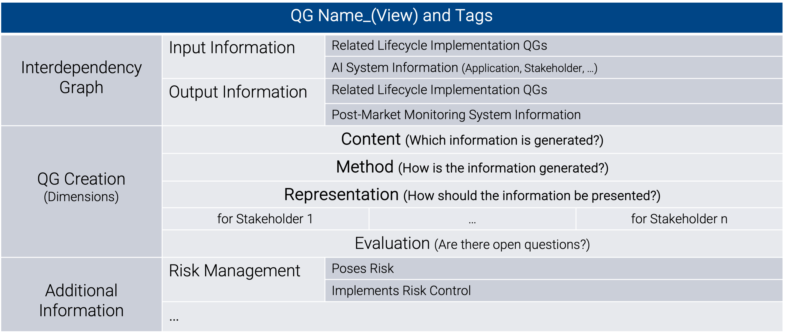

# MQG4AI

MQG4AI (*Methodology based on Quality Gates towards Certifiable AI*) is interpreted as a meta-standard towards high-quality by lifecycle design, incorporating criteria for AI standards, as outlined by the European Commission on [Harmonised Standards for the European AI Act](https://publications.jrc.ec.europa.eu/repository/handle/JRC139430). The proposed lifecycle information structure is envisioned to contribute to implementing [Responsible AI (RAI)](https://www.sciencedirect.com/science/article/pii/S1566253523002129) systems at the interface of regulation and implementation. Realizing compliant and trustworthy AI (TAI) is enabled through continuous, generic, and customizable information and knowledge management. For our design starting point, we focus on high-risk medical applications, while the methodology is intended to be generalizable, and our angle on MQG4AI design is derived from the *Development* stage, focusing on the provider perspective. Overall, MQG4AI is intended to support AI Quality Management Systems (AI QMS), as defined in Article 17 of the EU AI Act.

Addressing the dynamic state of AI design knowledge (i.e. standards, best practices, publications, ...), the blueprint offers a structure for continuously organizing novel, and existing AI design knowledge contributions on reliable lifecycle design approaches by the scientific community, standardization bodies, as well as the industry in a decentralized manner. 
Simultaneously, the shared lifecycle information processing format aims to support the implementation of use case-specific AI systems for application (and compliance assessment) by AI providers (and regulators) in form of a lifecycle template structure, which is first derived from the global knowledge collection. This dual system results in two MQG4AI *Interaction Scenarios*. 

Highlighting regulatory requirements, as introduced for AI QMS, we introduce *Information Blocks*, aiming to capture relevant contextual information for high-quality design. Our focus to kick-start MQG4AI design lies on risk management (Article 9) and related AI system-specific information. 
AI lifecycles are linked with contextual information through *Quality Gates* (QG). They form the core of the MQG4AI lifecycle design building kit and construct (MQG4A) / organize (MQG4DK) AI lifecycles in a flexible manner, reflecting relevant processes and design decisions under consideration of technical, conceptual, and contextual interdependencies. 
Aiming for customizability, additional (optional/required) QGs, QG information layers and contextual information blocks can be appended as reasonable. The overall setup is intended to address the interface of development and regulation. 

The repository is a work in progress, and further completing the MQG4AI living lifecycle blueprint with generalizable information across all high-risk AI systems is part of ongoing research. It is envisioned to continue in a decentralized manner. Possible contribution scenarios, and MQG4AI building blocks, including examples are outlined below. Refer to [related work](./RelatedWork.md) for an overview of related publications that contribute to MQG4AI design. 

## MQG4AI Interaction Scenarios: Decentralized AI Design Knowledge Base and Application 
The proposed dual system is based on principles from [Design Science Research](https://www.researchgate.net/publication/345430098_Introduction_to_Design_Science_Research) (the on-going communication of an abstract design knowledge base and concrete application scenarios to test, extend, and update (RAI) design knowledge in a decentralized manner), aiming to address the continuously evolving dynamics of RAI design knowledge generation, including the multitude of existing approaches:

- **Public MQG4DesignKnowledge (MQG4DK)** is envisioned to summarize the ever evolving and dynamic AI design knowledge, based on the unifying information processing format. *Quality Gates* construct the AI *Lifecycle*, and relate design decision-making with other relevant information towards RAI by desin. MQG4DK is intended to grow in a decentralized manner to comprise more use case-specific design information. We start to design the foundational, living lifecycle blueprint structure, including contextual *information blocks*, illustrated for *AI System*-specific, and identified AI risks, which are linked with lifecycle design through *QGs*. Envisioned contribution scenarios are outlined below.
- **Private MQG4Application (MQG4A)** is intended to provide qualitative, and use case-specific AI *Lifecycle* conceptualization templates, that enable collaborative and traceable design, based on the shared blueprint structure. MQG4A is intended to function as an additional management layer during AI projects, focusing on iterative *AI Lifecycle* design decision information management, and linking through documenting different template versions. An exemplary compilation of [MQG4A versions](./MQG4Application/) is provided.
    > The use case-adaptation of the MQG4A template(s) is envisioned to be realized by a configurable pull version from MQG4DK (MQG4A-v0), which is tailored to individual AI systems through an intelligent search that identifies relevant information-tags within QGs that reflect more concrete implementation guidelines for individual design decisions. As a result, only use case-specific *Lifecycle* design decisions, and related relevant information for high-risk systems are pulled from the design knowledge base. This is based on the [Git Branching Structure](https://git-scm.com/book/en/v2/Git-Branching-Branches-in-a-Nutshell).

 

> Four fundamental principles shape the MQG4AI blueprint design kit, aiming towards overall risk mitigation (they are closely tied to [general](./MQG4DesignKnowledge/1_System/Ethics_General/Ethics_General.md) and [use case-specific](./MQG4DesignKnowledge/1_System/Application/Ethics_Specific/Ethics_Specific.md) ethical questions):
>> 1. **Domain-Embedding** - the true success can only be measured in the ever evolving real world, and domain-adaptation contributes towards interpretability.
>> 2. **Stakeholder Inclusion** - a diverse compilation of stakeholders enables a perspective-dense approach to designing AI systems, guiding its impact, and promoting trustworthiness, while addressing AI literacy among all stakeholders.
>> 3. **Interdependency Analysis** - sheding light on lifecycle-specific interdependencies ensures a robust implementation.
>> 4. **Risk Analysis & Mitigation** - all of the above contribute to a comprehensive risk analysis and mitigation, which is very dynamic, use case-specific, and necessitates addressing the black box character of complex AI techniques from various application-specific perspectives, shaping and aligning with the desired function in the real world.

 

## MQG4AI Information Blocks: Towards Responsible AI

MQG4AI *Information Blocks* address relevant contextual information. The proposed lifecycle blueprint design kit is envisioned to provide a unifying approach that bridges the gap between ethics, regulation, and accountable implementation [(RAI)](https://www.sciencedirect.com/science/article/pii/S1566253523002129), enabling human-AI collaboration through transparent and documented system design. MQG4AI is intended as a contribution to AI QMS, which summarizes requirements for high-risk AI, as introduced in Article 17 of the AI Act, bridging implementation and regulation. 

Addressing regulatory requirements, we focus on the identification of AI risks as relevant contextual information, illustrating MQG4AI *Information Blocks*. We propose to organize AI risks according to Trustworthy AI (TAI) requirements [ALTAI](https://digital-strategy.ec.europa.eu/en/library/ethics-guidelines-trustworthy-ai) in the [Risk Management](./MQG4DesignKnowledge/3_RiskManagement/AI_RiskManagement.md) information block, including linking with [AI System](./MQG4DesignKnowledge/1_System/AI_System.md)-specific information. This contextual information, which shapes lifecycle design decision-making is accessed along the [AI lifecycle](./MQG4DesignKnowledge/2_Lifecycle/AI_Lifecycle.md) within individual QG-creation, as illustarted below. 

The, at the current state extracted information flow between the three identified *Information Blocks* is illustrated as follows. All information modules communicate with one another:

{width=800 height=}

System information:
- Defines risk management information
    - e.g. the application's area of impact helps identify potential risk sources (risk analysis), specific stakeholder roles may be more prone to system misuse (risk analysis), and implemented standards towards compliance may result in risk mitigation (risk control)
- Shapes the lifecycle implementation
    - e.g. domain knowledge surrounding the application is relevant for design decision-making

Risk Management:
- Defines system information
    - e.g. the risk management system needs to be documented, and identifying and monitoring relevant information is part of the proposed MQG4AI blueprint structure (documentation), ethics training of contributing stakeholders may contribute to implemented risk controls addressing the human influence, as well as continuous learning (stakeholder)
- Assigns information to the lifecycle implementation
    - e.g. the implementation of risk controls needs to be continuously monitored, which necessitates observing generated results
    
Information on the lifecycle implementation:
- Shapes system information
    - e.g. a post-market monitoring system needs to be implemented and documented, as well as information on the system's accuracy communicated to the user (documentation)
- Assigns information to risk management
    - e.g. a compilation of design decisions may function as risk controls/risk source

  

## *Quality Gates* (QG) for *Lifecycle* Information Management

Generic and customizable *Quality Gates* (QG) comprise the fundamental building block of MQG4AI for information linking with, and within the AI lifecycle. They are derived from traditional software engineering and project development, adapted to the AI context, and designed to incorporate AI-specific dynamics for high-quality information management, transformation and extraction. Lifecycle design decisions and design decision-making shape the (desired) quality of AI systems, and we emphasize AI knowledge management to monitor dynamic and use case-specific lifecycle information. As a result, QGs reflect the individual *Lifecycle* (MQG4A), and incorporate lifecycle design knowledge (MQG4DK). They link relevant information with other lifecycle QGs, as well as relevant contextual information, such as on the *AI System*, and *Risk Management*. 

> **Assumption**:
> The AI System is interpreted as the sum of all underlying processes and design decisions. 
    >> QGs are mapped along the *Lifecycle*, reflecting processes and design decisions. They enable a continuous supervision of conceptual information, while highlighting interdependencies through the extraction of input and output information. The generic and customizable QG-format is based on a three-fold structure at its core, while providing customizability through the option to append additional layers for further information extraction. *Quality Gates* are explained in detail below.

### QG-Graph along the *AI Lifecycle*
Generally, two *QG Types* exist to capture lifecycle processes and more concrete design decisions: **Collection-QGs** and **Leaf-QGs**.
The *QG-Graph* is characterized by a hierarchical structure from abstract and generic high-level QG-collections through multiple sub-level QG-collections to use case-specific leaf-QGs. 

The unifying QG-naming structure and customizable QG-creation information processing, enable the extraction of interdependencies in form of a the resulting project-specific QG-graph structure with bi- and uni-directional information connections between related QGs and contextual information. As a result, a *QG Scoring System* can be implemented, processing information from varying lifecycle scopes, based on the resulting *QG Graph Structure*. The root-node *QG4Application* enables overall system evaluation scenarios that process comprehensive information on all *Lifecycle*-QGs (see below). 

The **Conceptualization** stage is the starting point of MQG4A, and serves to fill in the template with relevant QGs, related with project-specific system information, based on MQG4DK. Overall, this section is envisioned to monitor updates of iteration cycles, and different MQG4A-template versions, aiming to provide shared knowledge to all stakeholders, and to offer a structure for further project-specific knowledge contributions. 

#### High-level Collection-QGs
Collection-QGs reflect (high-level) lifecycle processes, summarizing and structuring related *sub-QGs*. They can include up to $n$ sub-QG levels that are either collection- or leaf-QGs (see QG-format below, for a horizontal view on shared knowledge contributions to the same AI technique illustrated for the *Development* stage). This interplay realizes the transition from generic process stages to use case-specific design decisions within the proposed MQG4AI information blueprint. They build the QG-Graph and identify vertical interdependencies that are envisioned to be generalizable across use cases for the AI lifecycle, while their respective leaf-QGs provide more use case-specific information tailored to specific AI techniques.

> **Example explainable AI (XAI) lifecycle stage during development**:
> The proposed vertical QG-graph for XAI is depicted, focusing on quality evaluation metrics for explanations without an existing groundtruth. Appending a concrete implementation guideline for MQG4DK, the path results in a possible leaf-QG implementation for the evaluation of two specific XAI-methods (SHAP, LIME) that are relevant during the *Development* stage to assess their applicability. This implementation-guideline will only be part of MQG4A, if SHAP and LIME explanations are included in the configuration, while the Collection-QGs contribute to the default-template, since applied explanations need to be evaluated. The related MQG4DK leaf-QG is illustrated [here](./MQG4DesignKnowledge/2_Lifecycle/2_Development/4_Model_Explanation/Method_Evaluation/Quality/QG_FidelityRobustnessScore_(SHAPLIME).md).

#### Generic and Customizable Leaf-QG-Format
Leaf-QGs mirror more use case-specific *AI Lifecycle* design decisions. At their core, we propose to organize leaf-QG-creation based on a three-fold structure. In relation to relevant input, and output information, a comprehensive interdependency analysis along the AI lifecycle is enabled, towards testing by design of acceptable implementation approaches. Further, additional layers are intended to bridge the gap to overall information management to enable the inclusion of further relevant information towards compliant application.

> Our starting point for defining the [leaf-QG-format template](./templates/Template_LeafQG.md) addresses the on-going conceptualization of the *Lifecycle Development* stage, broaching the strongly related *Data* stage. We focus on information extraction for the *Content* and *Method* Dimension, and illustrate the *Representation* dimension, as well as relevant information extraction for *Deployment*, and *Maintenance*. For additional information layer definition, we focus on TAI-*Risk Management*. The format might need to be adjusted for other stages and *AI System* information, and the basic template building blocks (required or optional *Information Layers*) are intended to provide sufficient customizability.

- *Input Information* comprises *AI System*-relevant information, and other *Lifecycle* QGs that provide necessary information for individual QG-creation.
- *Output Information* extracts *Post-Market-Monitoring System*-relevant information, as well as other related *Lifecycle*-QGs that are impacted.

#### QG-Naming
The naming-structure is intended to identify horizontal *Lifecycle*-interdependencies of shared contributions addressing a particular AI scenario for information structuring focusing on MQG4DK: **QG_name_(view)**  (MQG4A may require a different approach, e.g. enabling information search within the evolving template versions.)
- *Name* describes the QG-content.
- *View* describes the AI technique where this QG is applicable to fill the MQG4DK living lifecycle blueprint.

> **Example explainable AI (XAI) method evaluation**: *QG_FidelityRobustnessScore_(SHAPLIME)* contributes a Fidelity-Robustness-Score to evaluate SHAP and LIME generated explanations to the generalizable requirement XAI quality evaluation to address the risk *Unfaithful explanations* which is related to the *Transparency*-requirement *Explainability*. Other contributions within collection-QG XAI Quality Evaluation can append the measurement of different methods, or extend the existing Fidelity-Robustness-Score with further information for other XAI-methods, for instance.

#### QG-Tags
Tags are relevant to identify use case-specific *Lifecycle*-QGs to be pulled into the MQG4A-v0 template. Other more high-level and generic collection-QGs and information blocks, are part of the default high-risk MQG4AI blueprint that bridges MQG4DK and MQG4A.

- Outlook: Intelligent tag-search based on a .config file to kick-start the *Lifecycle* conceptualization stage. (With respect to MQG4A, possibly an additional project-internal tag-layer may be reasonable. Internal information could refer to template versions, for instance.) 

- Information structure of tags is based on:
    > [Software-Engineering Design Patterns for Machine Learning Applications](https://ieeexplore.ieee.org/document/9734272)
    >> tags: [{Name: }, {Intent: }, {Problem: }, {Solution: }, {Applicability: }, {Consequences: }, {Usage Example: }]

### Outlook: QG-based Knowledge Extraction and Transformation
The QG-Collections that comprise the generalizable, as well as individual *Lifecycle*, QG-names, and QG-tags are envisioned to enable horizontal and vertical information search strategies for AI knowledge analysis along the QG-Graph, possibly resulting in a complex, knowledge-based QG-scoring system that may consist of multiple indexes with different objectives:
 > **Example abstract QG Metrics**: When searching *Metrics* (/*Score*/...), all relevant contributions that address system evaluation can be found, and evaluated for individual MQG4A scenarios, as well as to extract an overview of MQG4DK on the abstract *QG Metrics*, i.e. all design knowledge regarding existing AI-related metrics.

Further, this setup is envisioned to enable the extraction of additional information for AI system evaluation scenarios when analyzing multiple QGs combined, based on the extracted information which comprises individual QGs, and is summarized in the root-node *QG4Application* at the highest level.
> **Example Scoring System**: For instance, a trustworthiness score could be derived based on a vertical and horizontal analysis of stakeholder inclusion across all QGs within a pre-defined QG-Collection view. This corresponds to the fairness-related criterium [stakeholder participation](./MQG4DesignKnowledge/3_RiskManagement/AI_Risks/5_DiversityNon-DiscriminationFairness/StakeholderParticipation/LackofDomainExpertsCollaborationMechanisms.md).

 

## Template Design Roadmap and Contribution Scenarios
We kick-start MQG4AI design, which is envisioned to be continued in a decentralized manenr. This section highlights our contribution and possible MQG4AI design workflows.

QG-creation is illustrated focusing on the *Development* stage. We put particular emphasis on high-quality design decision-making, highlighting lifecycle interdependencies, linking with AI trustworthiness-related *Risk Management*, as well as high-risk *AI System*-specific information. For instance, extracting post-market monitoring system-relevant information from individual design decisions functions as a bridge between implementation and compliance. Different perspectives are possible to fill the MQG4DK information blocks with generally applicable high-risk information, and our proposition is a work in progress, aiming to provide customizability of information docking through generic MQG4AI lifecycle blueprint building blocks.

- To fill the MQG4DK lifecycle blueprint, we outline a transferrable workflow how to proceed with lifecycle design, and how RAI conceptual implementation knowledge can be integrated with MQG4DK. We highlight how to link related risk control *Lifecycle* implementation guidelines in form of generlaizable Collection-QGs, and AI technique/use case-specific Leaf-QGs. This is intended to be extendable for other high-risk default requirements, as e.g. outlined in Article 17 of the EU AI Act (AI Quality Management System).

- For quality validation, we illustrate how the proposed QG-structure aligns with existing publications, see [related work](RelatedWork.md) for an overview

- We provide sufficient customizability of all proposed building blocks for the multitude of possible MQG4A-scenarios, which needs to be tested in a next step. This can happen simultaneously to blueprint design. MQG4A-scenarios are envisioned to serve as a basis to further enhance the continuously growing MQG4DK living lifecycle blueprint in a decentralized manner.

### Starting Point: Information Management of RAI Knowledge
Responsible AI considers a wide range of technical and contextual information (ethical, accountable, and lawful). Focusing on risk identification, we propose to organize risks according to Trustworthy AI ([ALTAI](https://digital-strategy.ec.europa.eu/en/library/ethics-guidelines-trustworthy-ai)) and linked risk control implementation along the AI lifecycle through conceptual information management in form of QGs. Other regulatory requirements, such as required documentation or information on the application are linked through the *AI System* module to provide necessary *Lifecycle*-related information (based on the AI Risk Management Ontology ([AIRO](https://delaramglp.github.io/airo/#introduction))).
For our contribution, we focus on the *Development* stage, other phases may require a different approach.

Focusing on MQG4DK, we consider *Transparency* and *Technical Robustenss and Safety*-related risks, and highlight one particular requirement each to illustrate how QGs (design decisions) relate with generalizable *AI risks*, and result in possible *risk control* implementation guidelines along a generalizable *Lifecycle*-template in form of identified Collection-QGs, while considering relevant *AI System* information. In addition, we illustrate the application of our proposed customizable *Leaf-QG information processing template* for design decision-making towards RAI systems. 

#### MQG4DesignKnowledge: Transparency - Explainability
Focusing on related risks, we propose a generic explanation lifecycle stage design, and illustrate the identification of interdependencies between the *Lifecycle*, and *Risk Management* (see proposed [generic risk template](./templates/Template_Risk.md)). The resulting generalizable lifecycle process steps are validated against the [IEEE Guide for an Architectural Framework for Explainable Artificial Intelligence](https://ieeexplore.ieee.org/document/10659410).
We further illustrate the inclusion of a technical guideline within MQG4DK, based on the publication [On the transferability of local model‐agnostic explanations of machine learning models to unseen data](https://www.researchgate.net/publication/381757544_On_the_transferability_of_local_model-agnostic_explanations_of_machine_learning_models_to_unseen_data), which proposes a possible risk control mechanism:

> - Risk [Unfaithful Explanations](MQG4DesignKnowledge/3_RiskManagement/AI_Risks/4_Transparency/Explainability/UnfaithfulExplanations.md): [QG_FidelityRobustnessScore_(SHAPLIME)](MQG4DesignKnowledge/2_Lifecycle/2_Development/4_Model_Explanation/Method_Evaluation/Quality/QG_FidelityRobustnessScore_(SHAPLIME).md), illustrating the [leaf-QG format](./templates/Template_LeafQG.md)
> - Risk [Incomprehensible Explanations](MQG4DesignKnowledge/3_RiskManagement/AI_Risks/4_Transparency/Explainability/IncomprehensibleExplanations.md): User Interaction Stage - [QG_InteractionFlow_(UserExplainabilityInterpretation)](MQG4DesignKnowledge/2_Lifecycle/2_Development/4_Model_Explanation/UserInteraction/Interaction_Flow/QG_InteractionFlow_(UserExplainabilityInterpretation).md) and [QG_InformationInterface_(UserExplainabilityInterpretation)](MQG4DesignKnowledge/2_Lifecycle/2_Development/4_Model_Explanation/UserInteraction/Information_Interface/QG_InformationInterface_(UserExplainabilityInterpretation).md)

   

#### MQG4DesignKnowledge: Technical Robustness and Safety - Accuracy - Unreliable Performance Evaluation Metrics
We derive a compilation of QGs for responsible *Lifecycle* design decision-making from the publication [Towards Certifiable AI in Medicine: Illustrated for Multi-label ECG Classification Performance Metrics](https://ieeexplore.ieee.org/document/10570023) to outline the inclusion of design knowledge in QG-format in the *Lifecycle Development* module, as well as how it relates with *Risk Management*, and *AI System* information (broached for *Application* and *Stakeholder*). Concretely, we include a comprehensive evaluation strategy centered around a [fictional use case situated in emergency medicine](./MQG4DesignKnowledge/1_System/Application/example_ECGAlarmingGuardFunctionality_(EmergencyMedicine).md), and derive linked QGs for (multi-label) classification performance evaluation that provide a generalizable structure of related design decisions towards a responsible implementation:

> - Risk [Unreliable Performance Metrics](MQG4DesignKnowledge/3_RiskManagement/AI_Risks/2_TechnicalRobustnessSafety/Accuracy/UnreliablePerformanceMetrics.md): Illustrated reliable, and [generalizable performance evaluation metrics strategy](./MQG4DesignKnowledge/2_Lifecycle/2_Development/2_Model_Evaluation/PerformanceMetrics/) based on a compilation of QGs, closely related with domain knowledge towards risk mitigation.

#### MQG4Application simulated for Segmentation Model Selection
We simulate different template versions centered around the design decision "segmentation model selection", outling collaborative lifecycle design, where stakeholders construct the "main" lifecycle together, and may create "development" lifecycle snapshots for design decision-making, which can be revisited at later stages.
The segmentation model is embedded within the [medical software *EsophagusVisualization*](https://github.com/ds-lab/EsophagusVisualization) to support [medical research on, diagnosis and treatment of the rare disease Achalasia](https://www.researchgate.net/publication/372490765_PRECISION_MEDICINE_FOR_ACHALASIA_DIAGNOSIS_A_MULTI-MODAL_AND_INTERDISCIPLINARY_APPROACH_FOR_TRAINING_DATA_GENERATION?channel=doi&linkId=64ba16b8c41fb852dd8c935b&showFulltext=true). 

We propose to organize template snapshots for design decision-making during model development according to pre-, intra-, and post-selection information, documenting (and possibly standardizing) the design decision-making process. Illustrated for model selection (= our view on the illustrated MQG4A scenario), the intra-selection of two model configuration approaches only contains information that is relevant for the snapshot of our retrospective simulation / the design decision which model configuration to select. It is closely linked with data preprocessing and performance evaluation QGs, as highlighted below. Next steps include further optimization of the selected model, the establsihment of feedback loops during maintenance and deployment, among others, which can be documented through further lifecycle snapshots, possibly in parallel and by different stakeholders. Overall, MQG4AI's customizability allows for the creation of lifecycle template snap-shots for design-decision making. 

Disclaimer: We aim to illustrate what a possible MQG4A-scenario could look like based on an easy-to-understand example, and our technical contribution is not the focus. The proposed MQG4A template versions are illustrated as follows, inspired by the Git-branching structure:

{width=800 height=}

To further highlight MQG4AI's customizability, addressing the multi-faceted and use case-specific nature of design decisions, within "MQG4TBESegmentation", some design decisions are combined within a single leaf-QG. This depends on the scope how thorough other related design decisions are considered. For instance, within MQG4DK, collection-QG DataPreprocessing may consist of multiple leaf-QGs including data splitting strategy and data augmentation. These considerations are sumarized within a single leaf-QG pre-preprocessing in our MQG4A example. 

> Overall, MQG4AI is envisioned to provide customizable and flexible building blocks that reflect design decisions and can be adjusted and combined as deemed reasonable for the use case, or design knowledge contribution at hand, while it is important to inlcude all related information. 

> Possibly, depending on design decisions and how close they correspond to other design decisions, leaf-QGs may be appended to leaf-QGs (or leaf-/collection-QG hypbrids may be designed). For instance, model configuration is closely linked to hyperparameters and the definition process of e.g. the loss function can be captured as a single leaf-QG it could be reasonable to append that leaf-QG to the corresponding leaf-QG model configuration. The definition of the loss-function can be based on different template versions that capture the empirical results. 

 QG contributions within our example snapshot for model selection are organized as follows:
- (foundation) v0_MQG4DK: comprehensive template as pulled from the design knowledge base MQG4DK. The current version does not contain additional information on concrete lifecycle design decision-making that is relevant to a segmentation use case.
- (main) v1_MQG4TBESegmentation_(PreSelection): This template version contains information that is gathered before deciding which model configuration to apply: 
    - System:
        - [System-information on the application](./MQG4Application/v1_MQG4TBESegmentation_(PreSelection)/1_System/Application/TBE_Segmentation.md), as well as [domain knowledge on Achalasia](./MQG4Application/v1_MQG4TBESegmentation_(PreSelection)/1_System/Application/DomainKnowledge/Achalasia.md) 
        - Simulated parts of [Documentation](./MQG4Application/v1_MQG4TBESegmentation_(PreSelection)/1_System/Documentation/Documentation.md) focusing on a user manual *(automation bias mitigation)*
        - Outlined a selection of relevant [Stakeholders](./MQG4Application/v1_MQG4TBESegmentation_(PreSelection)/1_System/Stakeholder/Stakeholder_(TBESegmentation).md) focusing on development
    - Lifecycle:
        - [Data design input](./MQG4Application/v1_MQG4TBESegmentation_(PreSelection)/2_Lifecycle/1_Data/1_Acquisition/QG_DataDesignInput_(TBESegmentation).md)
        - [Performance metrics selection](./MQG4Application/v1_MQG4TBESegmentation_(PreSelection)/2_Lifecycle/2_Development/2_Model_Evaluation/PerformanceMetrics/QG_PerformanceMetricsCompilation_(Segmentation).md)
        - [Feedback loops](./MQG4Application/v1_MQG4TBESegmentation_(PreSelection)/2_Lifecycle/4_Maintenance/Support/QG_FeedbackLoops_(TBE_Segmentation).md) *(lack of collaboration mechanisms mitigation)*
    - Risk Management:
        - [Inaccurate model output](./MQG4Application/v1_MQG4TBESegmentation_(PreSelection)/3_RiskManagement/2_TechnicalRobustnessSafety/Accuracy/InaccurateModelOutput_(TBE_Segmentation).md), as main risk related to model selection
        - [Lack of collaboration mechanisms](./MQG4Application/v1_MQG4TBESegmentation_(PreSelection)/3_RiskManagement/5_DiversityNon-DiscriminationFairness/StakeholderParticipation/LackofCollaborationMechanisms_(TBE_Segmentation).md), as a cause for possibly missing inaccurate model output during maintenance
        - [Waste of computing resources](./MQG4Application/v1_MQG4TBESegmentation_(PreSelection)/3_RiskManagement/6_SocietalEnvironmentalWellbeing/EnvironmentalWellbeing/WasteOfComputingResources_(TBE_Segmentation).md), as a risk resulting from not using the segmentation model due to bad performance
        - [Automation bias](./MQG4Application/v1_MQG4TBESegmentation_(PreSelection)/3_RiskManagement/1_HumanAgencyOversight/HumanOversight/AutomationBias_(TBE_Segmentation).md), as an identified cause of TBE segmentation model misuse 
- (development) v1a_nnU-Net_(IntraSelection) comprises additional information on the performance of the state of the art for medical image segmentation on our TBE data set:
    - Lifecycle:
        - [Data preprocessing nn-Unet](./MQG4Application/v1a_nnU-Net_(IntraSelection)/1_Data/QG_DataPreprocessing_(nnU-Net).md)
        - [Model configuration nn-Unet](./MQG4Application/v1a_nnU-Net_(IntraSelection)/2_Development/1_Model_Configuration/QG_nnU-Net_(StateOfTheArt).md)
        - [Performance Evaluation nn-Unet](./MQG4Application/v1a_nnU-Net_(IntraSelection)/2_Development/2_Model_Evaluation/PerformanceMetrics/QG_PerformanceMetricsCompilation_(nnU-Net).md) - contains metrics and additional material in form of segmented model output on the test set
- (development) v1b_RCA-IUnet-BarlowTwins_(IntraSelection) comprises additional information on the performance of a segemntation approach designed for scarce data and medical image segmentation on our TBE data set as comparison:
    - Lifecycle:
        - [Data preprocessing RCA-IUnet-BarlowTwins](v1b_RCA-IUnet-BarlowTwins_(IntraSelection)/1_Data/QG_DataPreprocessing_(RCA-IUNet-BarlowTwins))
        - [Model configuration RCA-IUnet-BarlowTwins](./MQG4Application/v1b_RCA-IUnet-BarlowTwins_(IntraSelection)/2_Development/1_Model_Configuration/QG_RCA-IUnet-BarlowTwins_(Comparison).md)
        - [Performance Evaluation RCA-IUnet-BarlowTwins](./MQG4Application/v1b_RCA-IUnet-BarlowTwins_(IntraSelection)/2_Development/2_Model_Evaluation/PerformanceMetrics/QG_PerformanceMetricsCompilation_(RCA-IUnet-BarlowTwins).md) - contains metrics and additional material in form of segmented model output on the test set
- (main) v2_MQG4TBESegmentation_(PostSelection) extends v1_MQG4TBESegmentation_(PreSelection) with the selected model, links the identified risks with added QGs towards risk mitigation and appends optional additional QGs for post-selection steps:
    - Lifecycle:
        - [Data preprocessing nn-Unet](MQG4Application/v2_MQG4TBESegmentation_(PostSelection)/2_Lifecycle/1_Data/2_Utilization/2_Preprocessing/QG_DataPreprocessing_(nnU-Net).md) *(inaccurate model output mitigation)*
        - [Model configuration nn-Unet](./MQG4Application/v2_MQG4TBESegmentation_(PostSelection)/2_Lifecycle/2_Development/1_Model_Configuration/QG_nnU-Net_(StateOfTheArt).md) *(inaccurate model output mitigation)*
        - [Performance Evaluation nn-Unet](./MQG4Application/v2_MQG4TBESegmentation_(PostSelection)/2_Lifecycle/2_Development/2_Model_Evaluation/PerformanceMetrics/QG_PerformanceMetricsCompilation_(nnU-Net).md) *(inaccurate model output mitigation)*
        - [Optimization of nn-Unet](./MQG4Application/v2_MQG4TBESegmentation_(PostSelection)/2_Lifecycle/2_Development/3_Model_Optimization/QG_ModelOptimization_(Development).md) *(inaccurate model output mitigation)*  -  outlook, next steps
        - [Raw model output integration](./MQG4Application/v2_MQG4TBESegmentation_(PostSelection)/2_Lifecycle/1_Data/2_Utilization/3_ModelOutput/QG_RawModelOutput_(TBESegmentation).md) to ensure a seamless *EsophagusVisualization* workflow

### Next Steps
We are at the beginning of designing the MQG4AI lifecycle blueprint, and welcome collaborations. The following design aspects need to be tested in more detail, especially for MQG4A-scenarios:

- All *Lifecycle* stages need to be outlined in more detail for a generalizable design decision-making structure (generalizable Collection-QGs)
- The Leaf-QG-format needs to be tested for applicability from different stages than *Development*, and specifically for the *Representation*-Dimension
- QG-naming, -tagging, and the configurable pull version needs to be implemented, tested, and possibly refined for MQG4DK and MQG4A scenarios, highlighting versioning wihtin individual projects
- *AI System*, and *Risk Management* Information Blocks need to be further completed, highlighting required high-risk AI information (see AI Quality Management System in Article 17 of the AI Act)
- Develop a web-application that allows MQG4A, including a well-desinged user interface, addressing different stakeholder needs for usability
- A solid backend structure, that enables lifecycle template versioning (MQG4D) and decentralized contributions for MQG4DK, which needs support of a large institution  

> Overall, it is crucial to implement MQG4AI's building blocks in a customizable and flexible manner so that they can be reasonably organized by the respective stakeholder, reflecting the chosen approach to lifecycle design, enabling practical applicability of MQG4AI

Once the foundational blueprint is refined and its design tested, decentralized AI design-knowledge contributions in form of MQG4DK Leaf-QGs  are possible. extending the generic, living lifecycle blueprint that is constructed with generalizable *Lifecycle* QGs, following the proposed TAI-based risk-centered workflow, if:

> Pre-requisite MQG4DK-contribution: 
>> The RAI knowledge contribution needs to be validated for high-quality, positioned along the AI Lifecycle, aligned with the QG-format, and linked with TAI-risks and AI system information (and possibly other information blocks). Possibly, a public voting system for design decision leaf-QGs can be integrated, highlighting practicality of MQG4DK contributions

 

## Authors and acknowledgment
A big thank you to all contributors!
If you are interested in collaborating, feel free to connect.

- Miriam Elia (miriam.elia@uni-a.de)
- Alba Maria Lopez, Katherin Alexandra Corredor Páez 
- Bernhard Bauer, Esteban Garcia-Cuesta

## License
Apache License 2025 (copyright @miriamelia)
